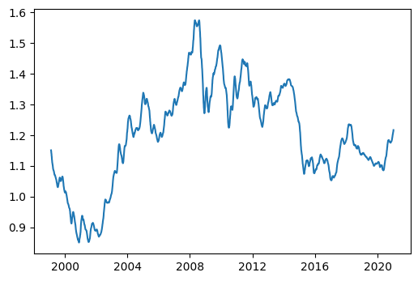
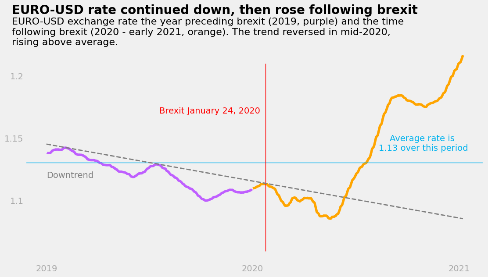

```python
import pandas as pd

exchange_rates = pd.read_csv('euro-daily-hist_1999_2020.csv')
print(exchange_rates.head())
```

      Period\Unit: [Australian dollar ] [Bulgarian lev ] [Brazilian real ]  \
    0   2021-01-08               1.5758           1.9558            6.5748   
    1   2021-01-07               1.5836           1.9558            6.5172   
    2   2021-01-06               1.5824           1.9558            6.5119   
    3   2021-01-05               1.5927           1.9558            6.5517   
    4   2021-01-04               1.5928           1.9558            6.3241   
    
      [Canadian dollar ] [Swiss franc ] [Chinese yuan renminbi ] [Cypriot pound ]  \
    0             1.5543         1.0827                   7.9184              NaN   
    1             1.5601         1.0833                   7.9392              NaN   
    2             1.5640         1.0821                   7.9653              NaN   
    3             1.5651         1.0803                   7.9315              NaN   
    4             1.5621         1.0811                   7.9484              NaN   
    
      [Czech koruna ] [Danish krone ]  ... [Romanian leu ] [Russian rouble ]  \
    0          26.163          7.4369  ...          4.8708           90.8000   
    1          26.147          7.4392  ...          4.8712           91.2000   
    2          26.145          7.4393  ...          4.8720           90.8175   
    3          26.227          7.4387  ...          4.8721           91.6715   
    4          26.141          7.4379  ...          4.8713           90.3420   
    
      [Swedish krona ] [Singapore dollar ] [Slovenian tolar ] [Slovak koruna ]  \
    0          10.0510              1.6228                NaN              NaN   
    1          10.0575              1.6253                NaN              NaN   
    2          10.0653              1.6246                NaN              NaN   
    3          10.0570              1.6180                NaN              NaN   
    4          10.0895              1.6198                NaN              NaN   
    
      [Thai baht ] [Turkish lira ] [US dollar ]  [South African rand ]  
    0      36.8480          9.0146       1.2250                18.7212  
    1      36.8590          8.9987       1.2276                18.7919  
    2      36.9210          9.0554       1.2338                18.5123  
    3      36.7760          9.0694       1.2271                18.4194  
    4      36.7280          9.0579       1.2296                17.9214  
    
    [5 rows x 41 columns]


```python
print(exchange_rates.tail())
```

         Period\Unit: [Australian dollar ] [Bulgarian lev ] [Brazilian real ]  \
    5694   1999-01-08               1.8406              NaN               NaN   
    5695   1999-01-07               1.8474              NaN               NaN   
    5696   1999-01-06               1.8820              NaN               NaN   
    5697   1999-01-05               1.8944              NaN               NaN   
    5698   1999-01-04               1.9100              NaN               NaN   
    
         [Canadian dollar ] [Swiss franc ] [Chinese yuan renminbi ]  \
    5694             1.7643         1.6138                      NaN   
    5695             1.7602         1.6165                      NaN   
    5696             1.7711         1.6116                      NaN   
    5697             1.7965         1.6123                      NaN   
    5698             1.8004         1.6168                      NaN   
    
         [Cypriot pound ] [Czech koruna ] [Danish krone ]  ... [Romanian leu ]  \
    5694          0.58187          34.938          7.4433  ...          1.3143   
    5695          0.58187          34.886          7.4431  ...          1.3092   
    5696          0.58200          34.850          7.4452  ...          1.3168   
    5697          0.58230          34.917          7.4495  ...          1.3168   
    5698          0.58231          35.107          7.4501  ...          1.3111   
    
         [Russian rouble ] [Swedish krona ] [Singapore dollar ]  \
    5694           27.2075           9.1650              1.9537   
    5695           26.9876           9.1800              1.9436   
    5696           27.4315           9.3050              1.9699   
    5697           26.5876           9.4025              1.9655   
    5698           25.2875           9.4696              1.9554   
    
         [Slovenian tolar ] [Slovak koruna ] [Thai baht ] [Turkish lira ]  \
    5694           188.8400           42.560      42.5590          0.3718   
    5695           188.8000           42.765      42.1678          0.3701   
    5696           188.7000           42.778      42.6949          0.3722   
    5697           188.7750           42.848      42.5048          0.3728   
    5698           189.0450           42.991      42.6799          0.3723   
    
         [US dollar ]  [South African rand ]  
    5694       1.1659                 6.7855  
    5695       1.1632                 6.8283  
    5696       1.1743                 6.7307  
    5697       1.1790                 6.7975  
    5698       1.1789                 6.9358  
    
    [5 rows x 41 columns]


```python
exchange_rates.info()
```

    <class 'pandas.core.frame.DataFrame'>
    RangeIndex: 5699 entries, 0 to 5698
    Data columns (total 41 columns):
     #   Column                    Non-Null Count  Dtype  
    ---  ------                    --------------  -----  
     0   Period\Unit:              5699 non-null   object 
     1   [Australian dollar ]      5699 non-null   object 
     2   [Bulgarian lev ]          5297 non-null   object 
     3   [Brazilian real ]         5431 non-null   object 
     4   [Canadian dollar ]        5699 non-null   object 
     5   [Swiss franc ]            5699 non-null   object 
     6   [Chinese yuan renminbi ]  5431 non-null   object 
     7   [Cypriot pound ]          2346 non-null   object 
     8   [Czech koruna ]           5699 non-null   object 
     9   [Danish krone ]           5699 non-null   object 
     10  [Estonian kroon ]         3130 non-null   object 
     11  [UK pound sterling ]      5699 non-null   object 
     12  [Greek drachma ]          520 non-null    object 
     13  [Hong Kong dollar ]       5699 non-null   object 
     14  [Croatian kuna ]          5431 non-null   object 
     15  [Hungarian forint ]       5699 non-null   object 
     16  [Indonesian rupiah ]      5699 non-null   object 
     17  [Israeli shekel ]         5431 non-null   object 
     18  [Indian rupee ]           5431 non-null   object 
     19  [Iceland krona ]          3292 non-null   float64
     20  [Japanese yen ]           5699 non-null   object 
     21  [Korean won ]             5699 non-null   object 
     22  [Lithuanian litas ]       4159 non-null   object 
     23  [Latvian lats ]           3904 non-null   object 
     24  [Maltese lira ]           2346 non-null   object 
     25  [Mexican peso ]           5699 non-null   object 
     26  [Malaysian ringgit ]      5699 non-null   object 
     27  [Norwegian krone ]        5699 non-null   object 
     28  [New Zealand dollar ]     5699 non-null   object 
     29  [Philippine peso ]        5699 non-null   object 
     30  [Polish zloty ]           5699 non-null   object 
     31  [Romanian leu ]           5637 non-null   float64
     32  [Russian rouble ]         5699 non-null   object 
     33  [Swedish krona ]          5699 non-null   object 
     34  [Singapore dollar ]       5699 non-null   object 
     35  [Slovenian tolar ]        2085 non-null   object 
     36  [Slovak koruna ]          2608 non-null   object 
     37  [Thai baht ]              5699 non-null   object 
     38  [Turkish lira ]           5637 non-null   float64
     39  [US dollar ]              5699 non-null   object 
     40  [South African rand ]     5699 non-null   object 
    dtypes: float64(3), object(38)
    memory usage: 1.8+ MB


```python
# provided data cleaning code:
exchange_rates.rename(columns={'[US dollar ]': 'US_dollar',
                               'Period\\Unit:': 'Time'},
                      inplace=True)
exchange_rates['Time'] = pd.to_datetime(exchange_rates['Time'])
exchange_rates.sort_values('Time', inplace=True)
exchange_rates.reset_index(drop=True, inplace=True)
```


```python
# Isolate the Time and the US_dollar columns. Assign them to a different variable named euro_to_dollar.
euro_to_dollar = exchange_rates[["Time", "US_dollar"]]
print(euro_to_dollar)
```

               Time US_dollar
    0    1999-01-04    1.1789
    1    1999-01-05    1.1790
    2    1999-01-06    1.1743
    3    1999-01-07    1.1632
    4    1999-01-08    1.1659
    ...         ...       ...
    5694 2021-01-04    1.2296
    5695 2021-01-05    1.2271
    5696 2021-01-06    1.2338
    5697 2021-01-07    1.2276
    5698 2021-01-08    1.2250
    
    [5699 rows x 2 columns]


```python
#Run the Series.value_counts() method on the US_dollar column, and see if you notice anything wrong.
euro_to_dollar["US_dollar"].value_counts()
```

    -         62
    1.2276     9
    1.1215     8
    1.1305     7
    1.0867     6
              ..
    1.1101     1
    1.2557     1
    1.2162     1
    1.3742     1
    1.2001     1
    Name: US_dollar, Length: 3528, dtype: int64


The first value is a hyphen, which appears 62 times.


```python
#Drop all the rows where the - character appears in the US_dollar column.
euro_to_dollar = euro_to_dollar[euro_to_dollar["US_dollar"]!='-']
print(euro_to_dollar)
```

               Time US_dollar
    0    1999-01-04    1.1789
    1    1999-01-05    1.1790
    2    1999-01-06    1.1743
    3    1999-01-07    1.1632
    4    1999-01-08    1.1659
    ...         ...       ...
    5694 2021-01-04    1.2296
    5695 2021-01-05    1.2271
    5696 2021-01-06    1.2338
    5697 2021-01-07    1.2276
    5698 2021-01-08    1.2250
    
    [5637 rows x 2 columns]


```python
#Convert the US_dollar column to a float data type.
euro_to_dollar["US_dollar"] = euro_to_dollar["US_dollar"].astype(float)
euro_to_dollar.info()
```

    <class 'pandas.core.frame.DataFrame'>
    Int64Index: 5637 entries, 0 to 5698
    Data columns (total 2 columns):
     #   Column     Non-Null Count  Dtype         
    ---  ------     --------------  -----         
     0   Time       5637 non-null   datetime64[ns]
     1   US_dollar  5637 non-null   float64       
    dtypes: datetime64[ns](1), float64(1)
    memory usage: 132.1 KB


```python
#Calculate the rolling means for the US_dollar column using a moving window of 30 days. Add the rolling means to a new column named rolling_mean.
euro_to_dollar["rolling_mean"] = euro_to_dollar["US_dollar"].rolling(30).mean()
```


```python
import matplotlib.pyplot as plt
%matplotlib inline 
#Enables Jupyter to display graphs

plt.plot(euro_to_dollar['Time'],
         euro_to_dollar['rolling_mean'])
plt.show()
```


    

    


On this screen, we're going to spend some time coming up with an idea for the graph we want to build. Our goal is to create a storytelling data visualization using the data we have.

To create a story, remember that we need to arrange our data into a series of events that show change.

Here are a few story ideas for our data:

We show how the euro-dollar rate has changed during the coronavirus pandemic. 
* We can show the 2020 data and the 2016-2019 data as a baseline. We can use a line plot.
* We show how the euro-dollar rate changed during the 2007-2008 financial crisis. We can also show the data for 2006 and 2009 for comparison. We can use a line plot.
* We show comparatively how the euro-dollar rate changed under the last three US presidents (George W. Bush (2001-2009), Barack Obama (2009-2017), and Donald Trump (2017-2021)). We can use a line plot.

Note one idea regarding the storytelling data visualization you want to build:
1. **Euro to dollar story before, during, and after brexit. Will use a line graph to plot year before, year of, and year after.**

Now that we know what story we want to tell, we're going to think more about how the graph is going to look.

First, we need to choose the right graph type. The graph should give our story the visual form it needs — we don't want to choose a histogram to visually represent a time series.

Equally important, we need to choose something that our audience will be familiar with. To simplify your work, you can choose any audience you want for your graph.

Next, we're going to sketch the graph — we do this before writing the code. In sketching the graph, it's important to use some of the principles we've learned so far:

* Maximize the data-ink ratio.
* Create visual patterns using Gestalt principles.
* Guide the audience's attention using pre-attentive attributes.

These design principles can help you in two ways:

They generate design options.
They help you choose among those options.

Using pen and paper, sketch the graph you want to create.

**According to this source, brexit was voted on at the beginning of 2020: https://en.wikipedia.org/wiki/Timeline_of_Brexit#:~:text=Brexit%20was%20the%20withdrawal%20of,the%20predecessor%20to%20the%20EU. I want to create a line graph ranging from 2019 to 2021 that emphasizes each year separately. I also want to display a horizontal line on the figure that shows the average of the 3 years so it can easily be seen the points where the value was above or below the average.**


```python
# Separating data for different years:
year_before = euro_to_dollar[euro_to_dollar["Time"].dt.year==2019]
print(year_before)
```

               Time  US_dollar  rolling_mean
    5182 2019-01-02     1.1397      1.138100
    5183 2019-01-03     1.1348      1.137837
    5184 2019-01-04     1.1403      1.137777
    5185 2019-01-07     1.1445      1.137897
    5186 2019-01-08     1.1440      1.138020
    ...         ...        ...           ...
    5432 2019-12-23     1.1075      1.106783
    5433 2019-12-24     1.1080      1.107000
    5434 2019-12-27     1.1153      1.107490
    5435 2019-12-30     1.1189      1.108130
    5436 2019-12-31     1.1234      1.108797
    
    [255 rows x 3 columns]


```python
year_during = euro_to_dollar[euro_to_dollar["Time"].dt.year==2020]
year_after = euro_to_dollar[euro_to_dollar["Time"].dt.year==2021]
print(year_after)
```

               Time  US_dollar  rolling_mean
    5694 2021-01-04     1.2296      1.211170
    5695 2021-01-05     1.2271      1.212530
    5696 2021-01-06     1.2338      1.213987
    5697 2021-01-07     1.2276      1.215357
    5698 2021-01-08     1.2250      1.216557


There is not enough data for 2021 to compare it with the other 2 previous years, so the plot will show before and after brexit only.


```python
years_after = euro_to_dollar[euro_to_dollar["Time"].dt.year>=2020]
print(years_after)
```

               Time  US_dollar  rolling_mean
    5437 2020-01-02     1.1193      1.109237
    5438 2020-01-03     1.1147      1.109470
    5439 2020-01-06     1.1194      1.109920
    5440 2020-01-07     1.1172      1.110190
    5441 2020-01-08     1.1115      1.110380
    ...         ...        ...           ...
    5694 2021-01-04     1.2296      1.211170
    5695 2021-01-05     1.2271      1.212530
    5696 2021-01-06     1.2338      1.213987
    5697 2021-01-07     1.2276      1.215357
    5698 2021-01-08     1.2250      1.216557
    
    [262 rows x 3 columns]


```python
# Get average exchange rate over this time period:

all_3_years = euro_to_dollar[(euro_to_dollar["Time"].dt.year>=2019) & (euro_to_dollar["Time"].dt.year<=2021)]
print(all_3_years)
average_rate = all_3_years["US_dollar"].mean()
print(average_rate)
```

               Time  US_dollar  rolling_mean
    5182 2019-01-02     1.1397      1.138100
    5183 2019-01-03     1.1348      1.137837
    5184 2019-01-04     1.1403      1.137777
    5185 2019-01-07     1.1445      1.137897
    5186 2019-01-08     1.1440      1.138020
    ...         ...        ...           ...
    5694 2021-01-04     1.2296      1.211170
    5695 2021-01-05     1.2271      1.212530
    5696 2021-01-06     1.2338      1.213987
    5697 2021-01-07     1.2276      1.215357
    5698 2021-01-08     1.2250      1.216557
    
    [517 rows x 3 columns]
    1.1318249516441006


```python
# Generating plot:

### Adding the FiveThirtyEight style
import matplotlib.style as style
style.use('fivethirtyeight')

fig, ax = plt.subplots(figsize=(12, 7))

ax.plot(year_before['Time'], year_before['rolling_mean'], color='#BF5FFF')
ax.plot(years_after['Time'], years_after['rolling_mean'], color='#ffa500')

ax.grid(alpha=0)
#import matplotlib.dates as mdates
#fmt = mdates.DateFormatter('%Y')
#ax.xaxis.set_major_formatter(fmt)
ax.set_xticklabels(['2019', '', '', '', '2020', '','', '', '2021'], alpha=0.3)
ax.set_ylim(1.05, 1.25)
ax.set_yticks([1.1, 1.15, 1.2, 1.25])
ax.set_yticklabels(['1.1', '1.15','1.2', ''], alpha=0.3)

#average line
ax.axhline(y=1.13, linewidth = 1, c = "#00B2EE")

#brexit line
import datetime
ax.axvline(x=datetime.date(2020, 1, 24), ymin=0.045, ymax = .8, c='red', linewidth = 1)

## Adding a title and a subtitle    
ax.text(datetime.date(2018, 11, 1), 1.25, '''EURO-USD rate continued down, then rose following brexit''', weight='bold', size = 20)
ax.text(datetime.date(2018, 11, 1), 1.225, '''EURO-USD exchange rate the year preceding brexit (2019, purple) and the time 
following brexit (2020 - early 2021, orange). The trend reversed in mid-2020,
rising above average. ''', size=16)

ax.text(datetime.date(2019, 7, 20), 1.17, "Brexit January 24, 2020", size=14, c = "red")
ax.text(datetime.date(2020, 10, 30), 1.14, '''Average rate is 
1.13 over this period''', size=14, c = "#00B2EE", horizontalalignment='center')

ax.plot([datetime.date(2019, 1,1),datetime.date(2021,1,8)], [1.145, 1.085], linewidth = 2, linestyle = "dashed", c = "grey") 
ax.text(datetime.date(2019, 1, 1), 1.118, "Downtrend", size=14, c = "grey")

plt.show()
```


    

    


The change over time in the EUR-USD exchange rate could have been influenced by many factors including the onset of the pandemic and new election cycles. This display highlights the price changes that occured in the brief timeline surrounding one political event.
