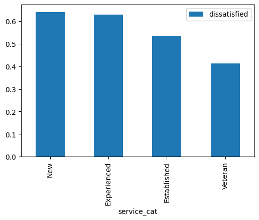

# Clean and Analyze Employee Exit Surveys

The goal of this project is to use data cleaning and analytical techniques to answer the following questions about the reasons for employees leaving their positions at Department of Education, Training, and Employment (DETE) and the Technical and Further Education (TAFE) institute:
* Are employees who only worked for the institutes for a short period of time resigning due to some kind of dissatisfaction? What about employees who have been there longer?
* Are younger employees resigning due to some kind of dissatisfaction? What about older employees?


```python
import pandas as pd
import numpy as np

dete_survey  = pd.read_csv("dete_survey.csv")
tafe_survey  = pd.read_csv("tafe_survey.csv")

print("\n dete survey info: \n")
dete_survey.info()
print("\n dete survey first 5 rows: \n")
print(dete_survey.head())

print("\n tafe survey info: \n")
tafe_survey.info()
print("\n tafe survey first 5 rows: \n")
print(tafe_survey.head())


```

    
     dete survey info: 
    
    <class 'pandas.core.frame.DataFrame'>
    RangeIndex: 822 entries, 0 to 821
    Data columns (total 56 columns):
     #   Column                               Non-Null Count  Dtype 
    ---  ------                               --------------  ----- 
     0   ID                                   822 non-null    int64 
     1   SeparationType                       822 non-null    object
     2   Cease Date                           822 non-null    object
     3   DETE Start Date                      822 non-null    object
     4   Role Start Date                      822 non-null    object
     5   Position                             817 non-null    object
     6   Classification                       455 non-null    object
     7   Region                               822 non-null    object
     8   Business Unit                        126 non-null    object
     9   Employment Status                    817 non-null    object
     10  Career move to public sector         822 non-null    bool  
     11  Career move to private sector        822 non-null    bool  
     12  Interpersonal conflicts              822 non-null    bool  
     13  Job dissatisfaction                  822 non-null    bool  
     14  Dissatisfaction with the department  822 non-null    bool  
     15  Physical work environment            822 non-null    bool  
     16  Lack of recognition                  822 non-null    bool  
     17  Lack of job security                 822 non-null    bool  
     18  Work location                        822 non-null    bool  
     19  Employment conditions                822 non-null    bool  
     20  Maternity/family                     822 non-null    bool  
     21  Relocation                           822 non-null    bool  
     22  Study/Travel                         822 non-null    bool  
     23  Ill Health                           822 non-null    bool  
     24  Traumatic incident                   822 non-null    bool  
     25  Work life balance                    822 non-null    bool  
     26  Workload                             822 non-null    bool  
     27  None of the above                    822 non-null    bool  
     28  Professional Development             808 non-null    object
     29  Opportunities for promotion          735 non-null    object
     30  Staff morale                         816 non-null    object
     31  Workplace issue                      788 non-null    object
     32  Physical environment                 817 non-null    object
     33  Worklife balance                     815 non-null    object
     34  Stress and pressure support          810 non-null    object
     35  Performance of supervisor            813 non-null    object
     36  Peer support                         812 non-null    object
     37  Initiative                           813 non-null    object
     38  Skills                               811 non-null    object
     39  Coach                                767 non-null    object
     40  Career Aspirations                   746 non-null    object
     41  Feedback                             792 non-null    object
     42  Further PD                           768 non-null    object
     43  Communication                        814 non-null    object
     44  My say                               812 non-null    object
     45  Information                          816 non-null    object
     46  Kept informed                        813 non-null    object
     47  Wellness programs                    766 non-null    object
     48  Health & Safety                      793 non-null    object
     49  Gender                               798 non-null    object
     50  Age                                  811 non-null    object
     51  Aboriginal                           16 non-null     object
     52  Torres Strait                        3 non-null      object
     53  South Sea                            7 non-null      object
     54  Disability                           23 non-null     object
     55  NESB                                 32 non-null     object
    dtypes: bool(18), int64(1), object(37)
    memory usage: 258.6+ KB
    
     dete survey first 5 rows: 
    
       ID                    SeparationType Cease Date DETE Start Date  \
    0   1             Ill Health Retirement    08/2012            1984   
    1   2  Voluntary Early Retirement (VER)    08/2012      Not Stated   
    2   3  Voluntary Early Retirement (VER)    05/2012            2011   
    3   4         Resignation-Other reasons    05/2012            2005   
    4   5                    Age Retirement    05/2012            1970   
    
      Role Start Date                                      Position  \
    0            2004                                Public Servant   
    1      Not Stated                                Public Servant   
    2            2011                               Schools Officer   
    3            2006                                       Teacher   
    4            1989  Head of Curriculum/Head of Special Education   
    
      Classification              Region                      Business Unit  \
    0        A01-A04      Central Office  Corporate Strategy and Peformance   
    1        AO5-AO7      Central Office  Corporate Strategy and Peformance   
    2            NaN      Central Office               Education Queensland   
    3        Primary  Central Queensland                                NaN   
    4            NaN          South East                                NaN   
    
         Employment Status  ...  Kept informed  Wellness programs  \
    0  Permanent Full-time  ...              N                  N   
    1  Permanent Full-time  ...              N                  N   
    2  Permanent Full-time  ...              N                  N   
    3  Permanent Full-time  ...              A                  N   
    4  Permanent Full-time  ...              N                  A   
    
       Health & Safety  Gender          Age  Aboriginal  Torres Strait  South Sea  \
    0                N    Male        56-60         NaN            NaN        NaN   
    1                N    Male        56-60         NaN            NaN        NaN   
    2                N    Male  61 or older         NaN            NaN        NaN   
    3                A  Female        36-40         NaN            NaN        NaN   
    4                M  Female  61 or older         NaN            NaN        NaN   
    
       Disability  NESB  
    0         NaN   Yes  
    1         NaN   NaN  
    2         NaN   NaN  
    3         NaN   NaN  
    4         NaN   NaN  
    
    [5 rows x 56 columns]
    
     tafe survey info: 
    
    <class 'pandas.core.frame.DataFrame'>
    RangeIndex: 702 entries, 0 to 701
    Data columns (total 72 columns):
     #   Column                                                                                                                                                         Non-Null Count  Dtype  
    ---  ------                                                                                                                                                         --------------  -----  
     0   Record ID                                                                                                                                                      702 non-null    float64
     1   Institute                                                                                                                                                      702 non-null    object 
     2   WorkArea                                                                                                                                                       702 non-null    object 
     3   CESSATION YEAR                                                                                                                                                 695 non-null    float64
     4   Reason for ceasing employment                                                                                                                                  701 non-null    object 
     5   Contributing Factors. Career Move - Public Sector                                                                                                              437 non-null    object 
     6   Contributing Factors. Career Move - Private Sector                                                                                                             437 non-null    object 
     7   Contributing Factors. Career Move - Self-employment                                                                                                            437 non-null    object 
     8   Contributing Factors. Ill Health                                                                                                                               437 non-null    object 
     9   Contributing Factors. Maternity/Family                                                                                                                         437 non-null    object 
     10  Contributing Factors. Dissatisfaction                                                                                                                          437 non-null    object 
     11  Contributing Factors. Job Dissatisfaction                                                                                                                      437 non-null    object 
     12  Contributing Factors. Interpersonal Conflict                                                                                                                   437 non-null    object 
     13  Contributing Factors. Study                                                                                                                                    437 non-null    object 
     14  Contributing Factors. Travel                                                                                                                                   437 non-null    object 
     15  Contributing Factors. Other                                                                                                                                    437 non-null    object 
     16  Contributing Factors. NONE                                                                                                                                     437 non-null    object 
     17  Main Factor. Which of these was the main factor for leaving?                                                                                                   113 non-null    object 
     18  InstituteViews. Topic:1. I feel the senior leadership had a clear vision and direction                                                                         608 non-null    object 
     19  InstituteViews. Topic:2. I was given access to skills training to help me do my job better                                                                     613 non-null    object 
     20  InstituteViews. Topic:3. I was given adequate opportunities for personal development                                                                           610 non-null    object 
     21  InstituteViews. Topic:4. I was given adequate opportunities for promotion within %Institute]Q25LBL%                                                            608 non-null    object 
     22  InstituteViews. Topic:5. I felt the salary for the job was right for the responsibilities I had                                                                615 non-null    object 
     23  InstituteViews. Topic:6. The organisation recognised when staff did good work                                                                                  607 non-null    object 
     24  InstituteViews. Topic:7. Management was generally supportive of me                                                                                             614 non-null    object 
     25  InstituteViews. Topic:8. Management was generally supportive of my team                                                                                        608 non-null    object 
     26  InstituteViews. Topic:9. I was kept informed of the changes in the organisation which would affect me                                                          610 non-null    object 
     27  InstituteViews. Topic:10. Staff morale was positive within the Institute                                                                                       602 non-null    object 
     28  InstituteViews. Topic:11. If I had a workplace issue it was dealt with quickly                                                                                 601 non-null    object 
     29  InstituteViews. Topic:12. If I had a workplace issue it was dealt with efficiently                                                                             597 non-null    object 
     30  InstituteViews. Topic:13. If I had a workplace issue it was dealt with discreetly                                                                              601 non-null    object 
     31  WorkUnitViews. Topic:14. I was satisfied with the quality of the management and supervision within my work unit                                                609 non-null    object 
     32  WorkUnitViews. Topic:15. I worked well with my colleagues                                                                                                      605 non-null    object 
     33  WorkUnitViews. Topic:16. My job was challenging and interesting                                                                                                607 non-null    object 
     34  WorkUnitViews. Topic:17. I was encouraged to use my initiative in the course of my work                                                                        610 non-null    object 
     35  WorkUnitViews. Topic:18. I had sufficient contact with other people in my job                                                                                  613 non-null    object 
     36  WorkUnitViews. Topic:19. I was given adequate support and co-operation by my peers to enable me to do my job                                                   609 non-null    object 
     37  WorkUnitViews. Topic:20. I was able to use the full range of my skills in my job                                                                               609 non-null    object 
     38  WorkUnitViews. Topic:21. I was able to use the full range of my abilities in my job. ; Category:Level of Agreement; Question:YOUR VIEWS ABOUT YOUR WORK UNIT]  608 non-null    object 
     39  WorkUnitViews. Topic:22. I was able to use the full range of my knowledge in my job                                                                            608 non-null    object 
     40  WorkUnitViews. Topic:23. My job provided sufficient variety                                                                                                    611 non-null    object 
     41  WorkUnitViews. Topic:24. I was able to cope with the level of stress and pressure in my job                                                                    610 non-null    object 
     42  WorkUnitViews. Topic:25. My job allowed me to balance the demands of work and family to my satisfaction                                                        611 non-null    object 
     43  WorkUnitViews. Topic:26. My supervisor gave me adequate personal recognition and feedback on my performance                                                    606 non-null    object 
     44  WorkUnitViews. Topic:27. My working environment was satisfactory e.g. sufficient space, good lighting, suitable seating and working area                       610 non-null    object 
     45  WorkUnitViews. Topic:28. I was given the opportunity to mentor and coach others in order for me to pass on my skills and knowledge prior to my cessation date  609 non-null    object 
     46  WorkUnitViews. Topic:29. There was adequate communication between staff in my unit                                                                             603 non-null    object 
     47  WorkUnitViews. Topic:30. Staff morale was positive within my work unit                                                                                         606 non-null    object 
     48  Induction. Did you undertake Workplace Induction?                                                                                                              619 non-null    object 
     49  InductionInfo. Topic:Did you undertake a Corporate Induction?                                                                                                  432 non-null    object 
     50  InductionInfo. Topic:Did you undertake a Institute Induction?                                                                                                  483 non-null    object 
     51  InductionInfo. Topic: Did you undertake Team Induction?                                                                                                        440 non-null    object 
     52  InductionInfo. Face to Face Topic:Did you undertake a Corporate Induction; Category:How it was conducted?                                                      555 non-null    object 
     53  InductionInfo. On-line Topic:Did you undertake a Corporate Induction; Category:How it was conducted?                                                           555 non-null    object 
     54  InductionInfo. Induction Manual Topic:Did you undertake a Corporate Induction?                                                                                 555 non-null    object 
     55  InductionInfo. Face to Face Topic:Did you undertake a Institute Induction?                                                                                     530 non-null    object 
     56  InductionInfo. On-line Topic:Did you undertake a Institute Induction?                                                                                          555 non-null    object 
     57  InductionInfo. Induction Manual Topic:Did you undertake a Institute Induction?                                                                                 553 non-null    object 
     58  InductionInfo. Face to Face Topic: Did you undertake Team Induction; Category?                                                                                 555 non-null    object 
     59  InductionInfo. On-line Topic: Did you undertake Team Induction?process you undertook and how it was conducted.]                                                555 non-null    object 
     60  InductionInfo. Induction Manual Topic: Did you undertake Team Induction?                                                                                       555 non-null    object 
     61  Workplace. Topic:Did you and your Manager develop a Performance and Professional Development Plan (PPDP)?                                                      608 non-null    object 
     62  Workplace. Topic:Does your workplace promote a work culture free from all forms of unlawful discrimination?                                                    594 non-null    object 
     63  Workplace. Topic:Does your workplace promote and practice the principles of employment equity?                                                                 587 non-null    object 
     64  Workplace. Topic:Does your workplace value the diversity of its employees?                                                                                     586 non-null    object 
     65  Workplace. Topic:Would you recommend the Institute as an employer to others?                                                                                   581 non-null    object 
     66  Gender. What is your Gender?                                                                                                                                   596 non-null    object 
     67  CurrentAge. Current Age                                                                                                                                        596 non-null    object 
     68  Employment Type. Employment Type                                                                                                                               596 non-null    object 
     69  Classification. Classification                                                                                                                                 596 non-null    object 
     70  LengthofServiceOverall. Overall Length of Service at Institute (in years)                                                                                      596 non-null    object 
     71  LengthofServiceCurrent. Length of Service at current workplace (in years)                                                                                      596 non-null    object 
    dtypes: float64(2), object(70)
    memory usage: 395.0+ KB
    
     tafe survey first 5 rows: 
    
          Record ID                              Institute  \
    0  6.341330e+17  Southern Queensland Institute of TAFE   
    1  6.341337e+17            Mount Isa Institute of TAFE   
    2  6.341388e+17            Mount Isa Institute of TAFE   
    3  6.341399e+17            Mount Isa Institute of TAFE   
    4  6.341466e+17  Southern Queensland Institute of TAFE   
    
                       WorkArea  CESSATION YEAR Reason for ceasing employment  \
    0  Non-Delivery (corporate)          2010.0              Contract Expired   
    1  Non-Delivery (corporate)          2010.0                    Retirement   
    2       Delivery (teaching)          2010.0                    Retirement   
    3  Non-Delivery (corporate)          2010.0                   Resignation   
    4       Delivery (teaching)          2010.0                   Resignation   
    
      Contributing Factors. Career Move - Public Sector   \
    0                                                NaN   
    1                                                  -   
    2                                                  -   
    3                                                  -   
    4                                                  -   
    
      Contributing Factors. Career Move - Private Sector   \
    0                                                NaN    
    1                                                  -    
    2                                                  -    
    3                                                  -    
    4                       Career Move - Private Sector    
    
      Contributing Factors. Career Move - Self-employment  \
    0                                                NaN    
    1                                                  -    
    2                                                  -    
    3                                                  -    
    4                                                  -    
    
      Contributing Factors. Ill Health Contributing Factors. Maternity/Family  \
    0                              NaN                                    NaN   
    1                                -                                      -   
    2                                -                                      -   
    3                                -                                      -   
    4                                -                                      -   
    
       ...  \
    0  ...   
    1  ...   
    2  ...   
    3  ...   
    4  ...   
    
      Workplace. Topic:Does your workplace promote a work culture free from all forms of unlawful discrimination?  \
    0                                                Yes                                                            
    1                                                Yes                                                            
    2                                                Yes                                                            
    3                                                Yes                                                            
    4                                                Yes                                                            
    
      Workplace. Topic:Does your workplace promote and practice the principles of employment equity?  \
    0                                                Yes                                               
    1                                                Yes                                               
    2                                                Yes                                               
    3                                                Yes                                               
    4                                                Yes                                               
    
      Workplace. Topic:Does your workplace value the diversity of its employees?  \
    0                                                Yes                           
    1                                                Yes                           
    2                                                Yes                           
    3                                                Yes                           
    4                                                Yes                           
    
      Workplace. Topic:Would you recommend the Institute as an employer to others?  \
    0                                                Yes                             
    1                                                Yes                             
    2                                                Yes                             
    3                                                Yes                             
    4                                                Yes                             
    
      Gender. What is your Gender? CurrentAge. Current Age  \
    0                       Female                  26  30   
    1                          NaN                     NaN   
    2                          NaN                     NaN   
    3                          NaN                     NaN   
    4                         Male                  41  45   
    
      Employment Type. Employment Type Classification. Classification  \
    0              Temporary Full-time            Administration (AO)   
    1                              NaN                            NaN   
    2                              NaN                            NaN   
    3                              NaN                            NaN   
    4              Permanent Full-time        Teacher (including LVT)   
    
      LengthofServiceOverall. Overall Length of Service at Institute (in years)  \
    0                                                1-2                          
    1                                                NaN                          
    2                                                NaN                          
    3                                                NaN                          
    4                                                3-4                          
    
      LengthofServiceCurrent. Length of Service at current workplace (in years)  
    0                                                1-2                         
    1                                                NaN                         
    2                                                NaN                         
    3                                                NaN                         
    4                                                3-4                         
    
    [5 rows x 72 columns]


```python
print(dete_survey.isnull())
print(dete_survey.isnull().sum())

```

            ID  SeparationType  Cease Date  DETE Start Date  Role Start Date  \
    0    False           False       False            False            False   
    1    False           False       False            False            False   
    2    False           False       False            False            False   
    3    False           False       False            False            False   
    4    False           False       False            False            False   
    ..     ...             ...         ...              ...              ...   
    817  False           False       False            False            False   
    818  False           False       False            False            False   
    819  False           False       False            False            False   
    820  False           False       False            False            False   
    821  False           False       False            False            False   
    
         Position  Classification  Region  Business Unit  Employment Status  ...  \
    0       False           False   False          False              False  ...   
    1       False           False   False          False              False  ...   
    2       False            True   False          False              False  ...   
    3       False           False   False           True              False  ...   
    4       False            True   False           True              False  ...   
    ..        ...             ...     ...            ...                ...  ...   
    817     False           False   False           True              False  ...   
    818     False           False   False           True              False  ...   
    819     False           False   False          False              False  ...   
    820     False           False   False           True              False  ...   
    821     False            True   False           True               True  ...   
    
         Kept informed  Wellness programs  Health & Safety  Gender    Age  \
    0            False              False            False   False  False   
    1            False              False            False   False  False   
    2            False              False            False   False  False   
    3            False              False            False   False  False   
    4            False              False            False   False  False   
    ..             ...                ...              ...     ...    ...   
    817          False              False            False   False  False   
    818          False              False            False   False  False   
    819          False              False            False   False  False   
    820          False              False            False   False  False   
    821           True               True             True    True   True   
    
         Aboriginal  Torres Strait  South Sea  Disability   NESB  
    0          True           True       True        True  False  
    1          True           True       True        True   True  
    2          True           True       True        True   True  
    3          True           True       True        True   True  
    4          True           True       True        True   True  
    ..          ...            ...        ...         ...    ...  
    817        True           True       True        True   True  
    818        True           True       True        True   True  
    819        True           True       True        True   True  
    820        True           True       True        True   True  
    821        True           True       True        True   True  
    
    [822 rows x 56 columns]
    ID                                       0
    SeparationType                           0
    Cease Date                               0
    DETE Start Date                          0
    Role Start Date                          0
    Position                                 5
    Classification                         367
    Region                                   0
    Business Unit                          696
    Employment Status                        5
    Career move to public sector             0
    Career move to private sector            0
    Interpersonal conflicts                  0
    Job dissatisfaction                      0
    Dissatisfaction with the department      0
    Physical work environment                0
    Lack of recognition                      0
    Lack of job security                     0
    Work location                            0
    Employment conditions                    0
    Maternity/family                         0
    Relocation                               0
    Study/Travel                             0
    Ill Health                               0
    Traumatic incident                       0
    Work life balance                        0
    Workload                                 0
    None of the above                        0
    Professional Development                14
    Opportunities for promotion             87
    Staff morale                             6
    Workplace issue                         34
    Physical environment                     5
    Worklife balance                         7
    Stress and pressure support             12
    Performance of supervisor                9
    Peer support                            10
    Initiative                               9
    Skills                                  11
    Coach                                   55
    Career Aspirations                      76
    Feedback                                30
    Further PD                              54
    Communication                            8
    My say                                  10
    Information                              6
    Kept informed                            9
    Wellness programs                       56
    Health & Safety                         29
    Gender                                  24
    Age                                     11
    Aboriginal                             806
    Torres Strait                          819
    South Sea                              815
    Disability                             799
    NESB                                   790
    dtype: int64


```python
print(dete_survey["SeparationType"].value_counts())
```

    Age Retirement                          285
    Resignation-Other reasons               150
    Resignation-Other employer               91
    Resignation-Move overseas/interstate     70
    Voluntary Early Retirement (VER)         67
    Ill Health Retirement                    61
    Other                                    49
    Contract Expired                         34
    Termination                              15
    Name: SeparationType, dtype: int64


```python
print(dete_survey["Aboriginal"].value_counts())
```

    Yes    16
    Name: Aboriginal, dtype: int64


```python
print(dete_survey["Disability"].value_counts())
```

    Yes    23
    Name: Disability, dtype: int64


```python
print(dete_survey["NESB"].value_counts())
```

    Yes    32
    Name: NESB, dtype: int64


```python
print(dete_survey["Lack of recognition"].value_counts())
```

    False    765
    True      57
    Name: Lack of recognition, dtype: int64


```python
print(tafe_survey.isnull().sum())
```

    Record ID                                                                      0
    Institute                                                                      0
    WorkArea                                                                       0
    CESSATION YEAR                                                                 7
    Reason for ceasing employment                                                  1
                                                                                ... 
    CurrentAge. Current Age                                                      106
    Employment Type. Employment Type                                             106
    Classification. Classification                                               106
    LengthofServiceOverall. Overall Length of Service at Institute (in years)    106
    LengthofServiceCurrent. Length of Service at current workplace (in years)    106
    Length: 72, dtype: int64


```python
print(tafe_survey["CESSATION YEAR"].value_counts())
```

    2011.0    268
    2012.0    235
    2010.0    103
    2013.0     85
    2009.0      4
    Name: CESSATION YEAR, dtype: int64


```python
print(tafe_survey["Employment Type. Employment Type"].value_counts())
```

    Permanent Full-time    237
    Temporary Full-time    177
    Contract/casual         71
    Permanent Part-time     59
    Temporary Part-time     52
    Name: Employment Type. Employment Type, dtype: int64


```python
print(tafe_survey["Institute"].value_counts())
```

    Brisbane North Institute of TAFE         161
    Southern Queensland Institute of TAFE    142
    Central Queensland Institute of TAFE     108
    Sunshine Coast Institute of TAFE          91
    Tropical North Institute of TAFE          70
    SkillsTech Australia                      57
    Southbank Institute of Technology         43
    Barrier Reef Institute of TAFE            14
    Mount Isa Institute of TAFE               12
    Wide Bay Institute of TAFE                 2
    Metropolitan South Institute of TAFE       1
    The Bremer Institute of TAFE               1
    Name: Institute, dtype: int64


```python
print(tafe_survey["Reason for ceasing employment"].value_counts())
```

    Resignation                 340
    Contract Expired            127
    Retrenchment/ Redundancy    104
    Retirement                   82
    Transfer                     25
    Termination                  23
    Name: Reason for ceasing employment, dtype: int64


```python
print(tafe_survey["WorkArea"].value_counts())
```

    Non-Delivery (corporate)    432
    Delivery (teaching)         270
    Name: WorkArea, dtype: int64


**Observation:**

From the above analysis, it appears the Dete survey could possibly benefit from modifying null values to "No" or "False" for consistency with other values or vice versa. The Tafe survey could benefit from cleaning up the headers. They make it hard to read the info summary and are lengthier than necessary.

**Observations from lesson explanation:**

* The dete_survey dataframe contains 'Not Stated' values that indicate values are missing, but they aren't represented as NaN.
* Both the dete_survey and tafe_survey dataframes contain many columns that we don't need to complete our analysis.
* Each dataframe contains many of the same columns, but the column names are different.
* There are multiple columns/answers that indicate an employee resigned because they were dissatisfied.

**Instructions**
* Read the dete_survey.csv CSV file into pandas again, but this time read the Not Stated values in as NaN.
 - To read Not Stated in as NaN, set the na_values parameter to Not Stated in the pd.read_csv() function.
 - Assign the result to the variable name dete_survey.
* Then, let's drop some columns from each dataframe that we won't use in our analysis to make the dataframes easier to work with.
 - Use the DataFrame.drop() method to drop the following columns from dete_survey: dete_survey.columns[28:49]. Remember to set the axis parameter equal to 1.
- Assign the result to dete_survey_updated.
* Use the DataFrame.drop() method to drop the following columns from tafe_survey: tafe_survey.columns[17:66]. Remember to set the axis parameter equal to 1.
- Assign the result to tafe_survey_updated.
* Write a markdown cell explaining the changes you made and why.


```python
dete_survey  = pd.read_csv("dete_survey.csv", na_values = "Not Stated")
```


```python
print(dete_survey.info())
```

    <class 'pandas.core.frame.DataFrame'>
    RangeIndex: 822 entries, 0 to 821
    Data columns (total 56 columns):
     #   Column                               Non-Null Count  Dtype  
    ---  ------                               --------------  -----  
     0   ID                                   822 non-null    int64  
     1   SeparationType                       822 non-null    object 
     2   Cease Date                           788 non-null    object 
     3   DETE Start Date                      749 non-null    float64
     4   Role Start Date                      724 non-null    float64
     5   Position                             817 non-null    object 
     6   Classification                       455 non-null    object 
     7   Region                               717 non-null    object 
     8   Business Unit                        126 non-null    object 
     9   Employment Status                    817 non-null    object 
     10  Career move to public sector         822 non-null    bool   
     11  Career move to private sector        822 non-null    bool   
     12  Interpersonal conflicts              822 non-null    bool   
     13  Job dissatisfaction                  822 non-null    bool   
     14  Dissatisfaction with the department  822 non-null    bool   
     15  Physical work environment            822 non-null    bool   
     16  Lack of recognition                  822 non-null    bool   
     17  Lack of job security                 822 non-null    bool   
     18  Work location                        822 non-null    bool   
     19  Employment conditions                822 non-null    bool   
     20  Maternity/family                     822 non-null    bool   
     21  Relocation                           822 non-null    bool   
     22  Study/Travel                         822 non-null    bool   
     23  Ill Health                           822 non-null    bool   
     24  Traumatic incident                   822 non-null    bool   
     25  Work life balance                    822 non-null    bool   
     26  Workload                             822 non-null    bool   
     27  None of the above                    822 non-null    bool   
     28  Professional Development             808 non-null    object 
     29  Opportunities for promotion          735 non-null    object 
     30  Staff morale                         816 non-null    object 
     31  Workplace issue                      788 non-null    object 
     32  Physical environment                 817 non-null    object 
     33  Worklife balance                     815 non-null    object 
     34  Stress and pressure support          810 non-null    object 
     35  Performance of supervisor            813 non-null    object 
     36  Peer support                         812 non-null    object 
     37  Initiative                           813 non-null    object 
     38  Skills                               811 non-null    object 
     39  Coach                                767 non-null    object 
     40  Career Aspirations                   746 non-null    object 
     41  Feedback                             792 non-null    object 
     42  Further PD                           768 non-null    object 
     43  Communication                        814 non-null    object 
     44  My say                               812 non-null    object 
     45  Information                          816 non-null    object 
     46  Kept informed                        813 non-null    object 
     47  Wellness programs                    766 non-null    object 
     48  Health & Safety                      793 non-null    object 
     49  Gender                               798 non-null    object 
     50  Age                                  811 non-null    object 
     51  Aboriginal                           16 non-null     object 
     52  Torres Strait                        3 non-null      object 
     53  South Sea                            7 non-null      object 
     54  Disability                           23 non-null     object 
     55  NESB                                 32 non-null     object 
    dtypes: bool(18), float64(2), int64(1), object(35)
    memory usage: 258.6+ KB
    None


```python
dete_survey_updated = dete_survey.drop(dete_survey.columns[28:49], axis = 1)
```


```python
print(dete_survey_updated.info())
```

    <class 'pandas.core.frame.DataFrame'>
    RangeIndex: 822 entries, 0 to 821
    Data columns (total 35 columns):
     #   Column                               Non-Null Count  Dtype  
    ---  ------                               --------------  -----  
     0   ID                                   822 non-null    int64  
     1   SeparationType                       822 non-null    object 
     2   Cease Date                           788 non-null    object 
     3   DETE Start Date                      749 non-null    float64
     4   Role Start Date                      724 non-null    float64
     5   Position                             817 non-null    object 
     6   Classification                       455 non-null    object 
     7   Region                               717 non-null    object 
     8   Business Unit                        126 non-null    object 
     9   Employment Status                    817 non-null    object 
     10  Career move to public sector         822 non-null    bool   
     11  Career move to private sector        822 non-null    bool   
     12  Interpersonal conflicts              822 non-null    bool   
     13  Job dissatisfaction                  822 non-null    bool   
     14  Dissatisfaction with the department  822 non-null    bool   
     15  Physical work environment            822 non-null    bool   
     16  Lack of recognition                  822 non-null    bool   
     17  Lack of job security                 822 non-null    bool   
     18  Work location                        822 non-null    bool   
     19  Employment conditions                822 non-null    bool   
     20  Maternity/family                     822 non-null    bool   
     21  Relocation                           822 non-null    bool   
     22  Study/Travel                         822 non-null    bool   
     23  Ill Health                           822 non-null    bool   
     24  Traumatic incident                   822 non-null    bool   
     25  Work life balance                    822 non-null    bool   
     26  Workload                             822 non-null    bool   
     27  None of the above                    822 non-null    bool   
     28  Gender                               798 non-null    object 
     29  Age                                  811 non-null    object 
     30  Aboriginal                           16 non-null     object 
     31  Torres Strait                        3 non-null      object 
     32  South Sea                            7 non-null      object 
     33  Disability                           23 non-null     object 
     34  NESB                                 32 non-null     object 
    dtypes: bool(18), float64(2), int64(1), object(14)
    memory usage: 123.7+ KB
    None


```python
tafe_survey_updated = tafe_survey.drop(tafe_survey.columns[17:66], axis = 1)
```


```python
print(tafe_survey_updated.info())
```

    <class 'pandas.core.frame.DataFrame'>
    RangeIndex: 702 entries, 0 to 701
    Data columns (total 23 columns):
     #   Column                                                                     Non-Null Count  Dtype  
    ---  ------                                                                     --------------  -----  
     0   Record ID                                                                  702 non-null    float64
     1   Institute                                                                  702 non-null    object 
     2   WorkArea                                                                   702 non-null    object 
     3   CESSATION YEAR                                                             695 non-null    float64
     4   Reason for ceasing employment                                              701 non-null    object 
     5   Contributing Factors. Career Move - Public Sector                          437 non-null    object 
     6   Contributing Factors. Career Move - Private Sector                         437 non-null    object 
     7   Contributing Factors. Career Move - Self-employment                        437 non-null    object 
     8   Contributing Factors. Ill Health                                           437 non-null    object 
     9   Contributing Factors. Maternity/Family                                     437 non-null    object 
     10  Contributing Factors. Dissatisfaction                                      437 non-null    object 
     11  Contributing Factors. Job Dissatisfaction                                  437 non-null    object 
     12  Contributing Factors. Interpersonal Conflict                               437 non-null    object 
     13  Contributing Factors. Study                                                437 non-null    object 
     14  Contributing Factors. Travel                                               437 non-null    object 
     15  Contributing Factors. Other                                                437 non-null    object 
     16  Contributing Factors. NONE                                                 437 non-null    object 
     17  Gender. What is your Gender?                                               596 non-null    object 
     18  CurrentAge. Current Age                                                    596 non-null    object 
     19  Employment Type. Employment Type                                           596 non-null    object 
     20  Classification. Classification                                             596 non-null    object 
     21  LengthofServiceOverall. Overall Length of Service at Institute (in years)  596 non-null    object 
     22  LengthofServiceCurrent. Length of Service at current workplace (in years)  596 non-null    object 
    dtypes: float64(2), object(21)
    memory usage: 126.3+ KB
    None


```python
print(tafe_survey.info())
```

    <class 'pandas.core.frame.DataFrame'>
    RangeIndex: 702 entries, 0 to 701
    Data columns (total 72 columns):
     #   Column                                                                                                                                                         Non-Null Count  Dtype  
    ---  ------                                                                                                                                                         --------------  -----  
     0   Record ID                                                                                                                                                      702 non-null    float64
     1   Institute                                                                                                                                                      702 non-null    object 
     2   WorkArea                                                                                                                                                       702 non-null    object 
     3   CESSATION YEAR                                                                                                                                                 695 non-null    float64
     4   Reason for ceasing employment                                                                                                                                  701 non-null    object 
     5   Contributing Factors. Career Move - Public Sector                                                                                                              437 non-null    object 
     6   Contributing Factors. Career Move - Private Sector                                                                                                             437 non-null    object 
     7   Contributing Factors. Career Move - Self-employment                                                                                                            437 non-null    object 
     8   Contributing Factors. Ill Health                                                                                                                               437 non-null    object 
     9   Contributing Factors. Maternity/Family                                                                                                                         437 non-null    object 
     10  Contributing Factors. Dissatisfaction                                                                                                                          437 non-null    object 
     11  Contributing Factors. Job Dissatisfaction                                                                                                                      437 non-null    object 
     12  Contributing Factors. Interpersonal Conflict                                                                                                                   437 non-null    object 
     13  Contributing Factors. Study                                                                                                                                    437 non-null    object 
     14  Contributing Factors. Travel                                                                                                                                   437 non-null    object 
     15  Contributing Factors. Other                                                                                                                                    437 non-null    object 
     16  Contributing Factors. NONE                                                                                                                                     437 non-null    object 
     17  Main Factor. Which of these was the main factor for leaving?                                                                                                   113 non-null    object 
     18  InstituteViews. Topic:1. I feel the senior leadership had a clear vision and direction                                                                         608 non-null    object 
     19  InstituteViews. Topic:2. I was given access to skills training to help me do my job better                                                                     613 non-null    object 
     20  InstituteViews. Topic:3. I was given adequate opportunities for personal development                                                                           610 non-null    object 
     21  InstituteViews. Topic:4. I was given adequate opportunities for promotion within %Institute]Q25LBL%                                                            608 non-null    object 
     22  InstituteViews. Topic:5. I felt the salary for the job was right for the responsibilities I had                                                                615 non-null    object 
     23  InstituteViews. Topic:6. The organisation recognised when staff did good work                                                                                  607 non-null    object 
     24  InstituteViews. Topic:7. Management was generally supportive of me                                                                                             614 non-null    object 
     25  InstituteViews. Topic:8. Management was generally supportive of my team                                                                                        608 non-null    object 
     26  InstituteViews. Topic:9. I was kept informed of the changes in the organisation which would affect me                                                          610 non-null    object 
     27  InstituteViews. Topic:10. Staff morale was positive within the Institute                                                                                       602 non-null    object 
     28  InstituteViews. Topic:11. If I had a workplace issue it was dealt with quickly                                                                                 601 non-null    object 
     29  InstituteViews. Topic:12. If I had a workplace issue it was dealt with efficiently                                                                             597 non-null    object 
     30  InstituteViews. Topic:13. If I had a workplace issue it was dealt with discreetly                                                                              601 non-null    object 
     31  WorkUnitViews. Topic:14. I was satisfied with the quality of the management and supervision within my work unit                                                609 non-null    object 
     32  WorkUnitViews. Topic:15. I worked well with my colleagues                                                                                                      605 non-null    object 
     33  WorkUnitViews. Topic:16. My job was challenging and interesting                                                                                                607 non-null    object 
     34  WorkUnitViews. Topic:17. I was encouraged to use my initiative in the course of my work                                                                        610 non-null    object 
     35  WorkUnitViews. Topic:18. I had sufficient contact with other people in my job                                                                                  613 non-null    object 
     36  WorkUnitViews. Topic:19. I was given adequate support and co-operation by my peers to enable me to do my job                                                   609 non-null    object 
     37  WorkUnitViews. Topic:20. I was able to use the full range of my skills in my job                                                                               609 non-null    object 
     38  WorkUnitViews. Topic:21. I was able to use the full range of my abilities in my job. ; Category:Level of Agreement; Question:YOUR VIEWS ABOUT YOUR WORK UNIT]  608 non-null    object 
     39  WorkUnitViews. Topic:22. I was able to use the full range of my knowledge in my job                                                                            608 non-null    object 
     40  WorkUnitViews. Topic:23. My job provided sufficient variety                                                                                                    611 non-null    object 
     41  WorkUnitViews. Topic:24. I was able to cope with the level of stress and pressure in my job                                                                    610 non-null    object 
     42  WorkUnitViews. Topic:25. My job allowed me to balance the demands of work and family to my satisfaction                                                        611 non-null    object 
     43  WorkUnitViews. Topic:26. My supervisor gave me adequate personal recognition and feedback on my performance                                                    606 non-null    object 
     44  WorkUnitViews. Topic:27. My working environment was satisfactory e.g. sufficient space, good lighting, suitable seating and working area                       610 non-null    object 
     45  WorkUnitViews. Topic:28. I was given the opportunity to mentor and coach others in order for me to pass on my skills and knowledge prior to my cessation date  609 non-null    object 
     46  WorkUnitViews. Topic:29. There was adequate communication between staff in my unit                                                                             603 non-null    object 
     47  WorkUnitViews. Topic:30. Staff morale was positive within my work unit                                                                                         606 non-null    object 
     48  Induction. Did you undertake Workplace Induction?                                                                                                              619 non-null    object 
     49  InductionInfo. Topic:Did you undertake a Corporate Induction?                                                                                                  432 non-null    object 
     50  InductionInfo. Topic:Did you undertake a Institute Induction?                                                                                                  483 non-null    object 
     51  InductionInfo. Topic: Did you undertake Team Induction?                                                                                                        440 non-null    object 
     52  InductionInfo. Face to Face Topic:Did you undertake a Corporate Induction; Category:How it was conducted?                                                      555 non-null    object 
     53  InductionInfo. On-line Topic:Did you undertake a Corporate Induction; Category:How it was conducted?                                                           555 non-null    object 
     54  InductionInfo. Induction Manual Topic:Did you undertake a Corporate Induction?                                                                                 555 non-null    object 
     55  InductionInfo. Face to Face Topic:Did you undertake a Institute Induction?                                                                                     530 non-null    object 
     56  InductionInfo. On-line Topic:Did you undertake a Institute Induction?                                                                                          555 non-null    object 
     57  InductionInfo. Induction Manual Topic:Did you undertake a Institute Induction?                                                                                 553 non-null    object 
     58  InductionInfo. Face to Face Topic: Did you undertake Team Induction; Category?                                                                                 555 non-null    object 
     59  InductionInfo. On-line Topic: Did you undertake Team Induction?process you undertook and how it was conducted.]                                                555 non-null    object 
     60  InductionInfo. Induction Manual Topic: Did you undertake Team Induction?                                                                                       555 non-null    object 
     61  Workplace. Topic:Did you and your Manager develop a Performance and Professional Development Plan (PPDP)?                                                      608 non-null    object 
     62  Workplace. Topic:Does your workplace promote a work culture free from all forms of unlawful discrimination?                                                    594 non-null    object 
     63  Workplace. Topic:Does your workplace promote and practice the principles of employment equity?                                                                 587 non-null    object 
     64  Workplace. Topic:Does your workplace value the diversity of its employees?                                                                                     586 non-null    object 
     65  Workplace. Topic:Would you recommend the Institute as an employer to others?                                                                                   581 non-null    object 
     66  Gender. What is your Gender?                                                                                                                                   596 non-null    object 
     67  CurrentAge. Current Age                                                                                                                                        596 non-null    object 
     68  Employment Type. Employment Type                                                                                                                               596 non-null    object 
     69  Classification. Classification                                                                                                                                 596 non-null    object 
     70  LengthofServiceOverall. Overall Length of Service at Institute (in years)                                                                                      596 non-null    object 
     71  LengthofServiceCurrent. Length of Service at current workplace (in years)                                                                                      596 non-null    object 
    dtypes: float64(2), object(70)
    memory usage: 395.0+ KB
    None


**Explanation:**

Removed unneccessary columns from dataframes to make them more manageable.

**Instructions**

* Rename the remaining columns in the dete_survey_updated dataframe. 
 - Use the following criteria to update the column names:
      1. Make all the capitalization lowercase.
      2. Remove any trailing whitespace from the end of the strings.
      3. Replace spaces with underscores ('_').
 - As an example, Cease Date should be updated to cease_date.
 - Remember you can use the DataFrame.columns attribute to print an array of the existing column names.
* Use the DataFrame.rename() method to update the columns below in tafe_survey_updated. Don't worry about the rest of the column names right now - we'll handle them later.
 - 'Record ID': 'id'
 - 'CESSATION YEAR': 'cease_date'
 - 'Reason for ceasing employment': 'separationtype'
 - 'Gender. What is your Gender?': 'gender'
 - 'CurrentAge. Current Age': 'age'
 - 'Employment Type. Employment Type': 'employment_status'
 - 'Classification. Classification': 'position'
 - 'LengthofServiceOverall. Overall Length of Service at Institute (in years)': 'institute_service'
 - 'LengthofServiceCurrent. Length of Service at current workplace (in years)': 'role_service'
* Use the DataFrame.head() method to look at the current state of the dete_survey_updated and tafe_survey_updated dataframes and make sure your changes look good.
* Write a markdown cell explaining the changes you made and why.


```python
# remove whitespace from beginning and end of strings. replace one or more spaces with underscore. make capitalization lowercase.
dete_survey_updated.columns = dete_survey_updated.columns.str.strip().str.replace('\s+', '_').str.lower()
```


```python
print(dete_survey_updated.columns)
```

    Index(['id', 'separationtype', 'cease_date', 'dete_start_date',
           'role_start_date', 'position', 'classification', 'region',
           'business_unit', 'employment_status', 'career_move_to_public_sector',
           'career_move_to_private_sector', 'interpersonal_conflicts',
           'job_dissatisfaction', 'dissatisfaction_with_the_department',
           'physical_work_environment', 'lack_of_recognition',
           'lack_of_job_security', 'work_location', 'employment_conditions',
           'maternity/family', 'relocation', 'study/travel', 'ill_health',
           'traumatic_incident', 'work_life_balance', 'workload',
           'none_of_the_above', 'gender', 'age', 'aboriginal', 'torres_strait',
           'south_sea', 'disability', 'nesb'],
          dtype='object')


```python
print(tafe_survey.columns)
```

    Index(['Record ID', 'Institute', 'WorkArea', 'CESSATION YEAR',
           'Reason for ceasing employment',
           'Contributing Factors. Career Move - Public Sector ',
           'Contributing Factors. Career Move - Private Sector ',
           'Contributing Factors. Career Move - Self-employment',
           'Contributing Factors. Ill Health',
           'Contributing Factors. Maternity/Family',
           'Contributing Factors. Dissatisfaction',
           'Contributing Factors. Job Dissatisfaction',
           'Contributing Factors. Interpersonal Conflict',
           'Contributing Factors. Study', 'Contributing Factors. Travel',
           'Contributing Factors. Other', 'Contributing Factors. NONE',
           'Main Factor. Which of these was the main factor for leaving?',
           'InstituteViews. Topic:1. I feel the senior leadership had a clear vision and direction',
           'InstituteViews. Topic:2. I was given access to skills training to help me do my job better',
           'InstituteViews. Topic:3. I was given adequate opportunities for personal development',
           'InstituteViews. Topic:4. I was given adequate opportunities for promotion within %Institute]Q25LBL%',
           'InstituteViews. Topic:5. I felt the salary for the job was right for the responsibilities I had',
           'InstituteViews. Topic:6. The organisation recognised when staff did good work',
           'InstituteViews. Topic:7. Management was generally supportive of me',
           'InstituteViews. Topic:8. Management was generally supportive of my team',
           'InstituteViews. Topic:9. I was kept informed of the changes in the organisation which would affect me',
           'InstituteViews. Topic:10. Staff morale was positive within the Institute',
           'InstituteViews. Topic:11. If I had a workplace issue it was dealt with quickly',
           'InstituteViews. Topic:12. If I had a workplace issue it was dealt with efficiently',
           'InstituteViews. Topic:13. If I had a workplace issue it was dealt with discreetly',
           'WorkUnitViews. Topic:14. I was satisfied with the quality of the management and supervision within my work unit',
           'WorkUnitViews. Topic:15. I worked well with my colleagues',
           'WorkUnitViews. Topic:16. My job was challenging and interesting',
           'WorkUnitViews. Topic:17. I was encouraged to use my initiative in the course of my work',
           'WorkUnitViews. Topic:18. I had sufficient contact with other people in my job',
           'WorkUnitViews. Topic:19. I was given adequate support and co-operation by my peers to enable me to do my job',
           'WorkUnitViews. Topic:20. I was able to use the full range of my skills in my job',
           'WorkUnitViews. Topic:21. I was able to use the full range of my abilities in my job. ; Category:Level of Agreement; Question:YOUR VIEWS ABOUT YOUR WORK UNIT]',
           'WorkUnitViews. Topic:22. I was able to use the full range of my knowledge in my job',
           'WorkUnitViews. Topic:23. My job provided sufficient variety',
           'WorkUnitViews. Topic:24. I was able to cope with the level of stress and pressure in my job',
           'WorkUnitViews. Topic:25. My job allowed me to balance the demands of work and family to my satisfaction',
           'WorkUnitViews. Topic:26. My supervisor gave me adequate personal recognition and feedback on my performance',
           'WorkUnitViews. Topic:27. My working environment was satisfactory e.g. sufficient space, good lighting, suitable seating and working area',
           'WorkUnitViews. Topic:28. I was given the opportunity to mentor and coach others in order for me to pass on my skills and knowledge prior to my cessation date',
           'WorkUnitViews. Topic:29. There was adequate communication between staff in my unit',
           'WorkUnitViews. Topic:30. Staff morale was positive within my work unit',
           'Induction. Did you undertake Workplace Induction?',
           'InductionInfo. Topic:Did you undertake a Corporate Induction?',
           'InductionInfo. Topic:Did you undertake a Institute Induction?',
           'InductionInfo. Topic: Did you undertake Team Induction?',
           'InductionInfo. Face to Face Topic:Did you undertake a Corporate Induction; Category:How it was conducted?',
           'InductionInfo. On-line Topic:Did you undertake a Corporate Induction; Category:How it was conducted?',
           'InductionInfo. Induction Manual Topic:Did you undertake a Corporate Induction?',
           'InductionInfo. Face to Face Topic:Did you undertake a Institute Induction?',
           'InductionInfo. On-line Topic:Did you undertake a Institute Induction?',
           'InductionInfo. Induction Manual Topic:Did you undertake a Institute Induction?',
           'InductionInfo. Face to Face Topic: Did you undertake Team Induction; Category?',
           'InductionInfo. On-line Topic: Did you undertake Team Induction?process you undertook and how it was conducted.]',
           'InductionInfo. Induction Manual Topic: Did you undertake Team Induction?',
           'Workplace. Topic:Did you and your Manager develop a Performance and Professional Development Plan (PPDP)?',
           'Workplace. Topic:Does your workplace promote a work culture free from all forms of unlawful discrimination?',
           'Workplace. Topic:Does your workplace promote and practice the principles of employment equity?',
           'Workplace. Topic:Does your workplace value the diversity of its employees?',
           'Workplace. Topic:Would you recommend the Institute as an employer to others?',
           'Gender. What is your Gender?', 'CurrentAge. Current Age',
           'Employment Type. Employment Type', 'Classification. Classification',
           'LengthofServiceOverall. Overall Length of Service at Institute (in years)',
           'LengthofServiceCurrent. Length of Service at current workplace (in years)'],
          dtype='object')


```python
new_names = {'Record ID':'id',
             'CESSATION YEAR':'cease_date',
             'Reason for ceasing employment':'separationtype',
             'Gender. What is your Gender?':'gender',
             'CurrentAge. Current Age':'age',
             'Employment Type. Employment Type':'employment_status',
             'Classification. Classification':'position',
             'LengthofServiceOverall. Overall Length of Service at Institute (in years)':'institute_service',
             'LengthofServiceCurrent. Length of Service at current workplace (in years)':'role_service'}
tafe_survey_updated.rename(columns = new_names, inplace = True)
print(tafe_survey_updated.columns)
```

    Index(['id', 'Institute', 'WorkArea', 'cease_date', 'separationtype',
           'Contributing Factors. Career Move - Public Sector ',
           'Contributing Factors. Career Move - Private Sector ',
           'Contributing Factors. Career Move - Self-employment',
           'Contributing Factors. Ill Health',
           'Contributing Factors. Maternity/Family',
           'Contributing Factors. Dissatisfaction',
           'Contributing Factors. Job Dissatisfaction',
           'Contributing Factors. Interpersonal Conflict',
           'Contributing Factors. Study', 'Contributing Factors. Travel',
           'Contributing Factors. Other', 'Contributing Factors. NONE', 'gender',
           'age', 'employment_status', 'position', 'institute_service',
           'role_service'],
          dtype='object')


```python
dete_survey_updated.head()
```


<div>
<style scoped>
    .dataframe tbody tr th:only-of-type {
        vertical-align: middle;
    }

    .dataframe tbody tr th {
        vertical-align: top;
    }

    .dataframe thead th {
        text-align: right;
    }
</style>
<table border="1" class="dataframe">
  <thead>
    <tr style="text-align: right;">
      <th></th>
      <th>id</th>
      <th>separationtype</th>
      <th>cease_date</th>
      <th>dete_start_date</th>
      <th>role_start_date</th>
      <th>position</th>
      <th>classification</th>
      <th>region</th>
      <th>business_unit</th>
      <th>employment_status</th>
      <th>...</th>
      <th>work_life_balance</th>
      <th>workload</th>
      <th>none_of_the_above</th>
      <th>gender</th>
      <th>age</th>
      <th>aboriginal</th>
      <th>torres_strait</th>
      <th>south_sea</th>
      <th>disability</th>
      <th>nesb</th>
    </tr>
  </thead>
  <tbody>
    <tr>
      <th>0</th>
      <td>1</td>
      <td>Ill Health Retirement</td>
      <td>08/2012</td>
      <td>1984.0</td>
      <td>2004.0</td>
      <td>Public Servant</td>
      <td>A01-A04</td>
      <td>Central Office</td>
      <td>Corporate Strategy and Peformance</td>
      <td>Permanent Full-time</td>
      <td>...</td>
      <td>False</td>
      <td>False</td>
      <td>True</td>
      <td>Male</td>
      <td>56-60</td>
      <td>NaN</td>
      <td>NaN</td>
      <td>NaN</td>
      <td>NaN</td>
      <td>Yes</td>
    </tr>
    <tr>
      <th>1</th>
      <td>2</td>
      <td>Voluntary Early Retirement (VER)</td>
      <td>08/2012</td>
      <td>NaN</td>
      <td>NaN</td>
      <td>Public Servant</td>
      <td>AO5-AO7</td>
      <td>Central Office</td>
      <td>Corporate Strategy and Peformance</td>
      <td>Permanent Full-time</td>
      <td>...</td>
      <td>False</td>
      <td>False</td>
      <td>False</td>
      <td>Male</td>
      <td>56-60</td>
      <td>NaN</td>
      <td>NaN</td>
      <td>NaN</td>
      <td>NaN</td>
      <td>NaN</td>
    </tr>
    <tr>
      <th>2</th>
      <td>3</td>
      <td>Voluntary Early Retirement (VER)</td>
      <td>05/2012</td>
      <td>2011.0</td>
      <td>2011.0</td>
      <td>Schools Officer</td>
      <td>NaN</td>
      <td>Central Office</td>
      <td>Education Queensland</td>
      <td>Permanent Full-time</td>
      <td>...</td>
      <td>False</td>
      <td>False</td>
      <td>True</td>
      <td>Male</td>
      <td>61 or older</td>
      <td>NaN</td>
      <td>NaN</td>
      <td>NaN</td>
      <td>NaN</td>
      <td>NaN</td>
    </tr>
    <tr>
      <th>3</th>
      <td>4</td>
      <td>Resignation-Other reasons</td>
      <td>05/2012</td>
      <td>2005.0</td>
      <td>2006.0</td>
      <td>Teacher</td>
      <td>Primary</td>
      <td>Central Queensland</td>
      <td>NaN</td>
      <td>Permanent Full-time</td>
      <td>...</td>
      <td>False</td>
      <td>False</td>
      <td>False</td>
      <td>Female</td>
      <td>36-40</td>
      <td>NaN</td>
      <td>NaN</td>
      <td>NaN</td>
      <td>NaN</td>
      <td>NaN</td>
    </tr>
    <tr>
      <th>4</th>
      <td>5</td>
      <td>Age Retirement</td>
      <td>05/2012</td>
      <td>1970.0</td>
      <td>1989.0</td>
      <td>Head of Curriculum/Head of Special Education</td>
      <td>NaN</td>
      <td>South East</td>
      <td>NaN</td>
      <td>Permanent Full-time</td>
      <td>...</td>
      <td>True</td>
      <td>False</td>
      <td>False</td>
      <td>Female</td>
      <td>61 or older</td>
      <td>NaN</td>
      <td>NaN</td>
      <td>NaN</td>
      <td>NaN</td>
      <td>NaN</td>
    </tr>
  </tbody>
</table>
<p>5 rows × 35 columns</p>
</div>


```python
tafe_survey_updated.head()
```


<div>
<style scoped>
    .dataframe tbody tr th:only-of-type {
        vertical-align: middle;
    }

    .dataframe tbody tr th {
        vertical-align: top;
    }

    .dataframe thead th {
        text-align: right;
    }
</style>
<table border="1" class="dataframe">
  <thead>
    <tr style="text-align: right;">
      <th></th>
      <th>id</th>
      <th>Institute</th>
      <th>WorkArea</th>
      <th>cease_date</th>
      <th>separationtype</th>
      <th>Contributing Factors. Career Move - Public Sector</th>
      <th>Contributing Factors. Career Move - Private Sector</th>
      <th>Contributing Factors. Career Move - Self-employment</th>
      <th>Contributing Factors. Ill Health</th>
      <th>Contributing Factors. Maternity/Family</th>
      <th>...</th>
      <th>Contributing Factors. Study</th>
      <th>Contributing Factors. Travel</th>
      <th>Contributing Factors. Other</th>
      <th>Contributing Factors. NONE</th>
      <th>gender</th>
      <th>age</th>
      <th>employment_status</th>
      <th>position</th>
      <th>institute_service</th>
      <th>role_service</th>
    </tr>
  </thead>
  <tbody>
    <tr>
      <th>0</th>
      <td>6.341330e+17</td>
      <td>Southern Queensland Institute of TAFE</td>
      <td>Non-Delivery (corporate)</td>
      <td>2010.0</td>
      <td>Contract Expired</td>
      <td>NaN</td>
      <td>NaN</td>
      <td>NaN</td>
      <td>NaN</td>
      <td>NaN</td>
      <td>...</td>
      <td>NaN</td>
      <td>NaN</td>
      <td>NaN</td>
      <td>NaN</td>
      <td>Female</td>
      <td>26  30</td>
      <td>Temporary Full-time</td>
      <td>Administration (AO)</td>
      <td>1-2</td>
      <td>1-2</td>
    </tr>
    <tr>
      <th>1</th>
      <td>6.341337e+17</td>
      <td>Mount Isa Institute of TAFE</td>
      <td>Non-Delivery (corporate)</td>
      <td>2010.0</td>
      <td>Retirement</td>
      <td>-</td>
      <td>-</td>
      <td>-</td>
      <td>-</td>
      <td>-</td>
      <td>...</td>
      <td>-</td>
      <td>Travel</td>
      <td>-</td>
      <td>-</td>
      <td>NaN</td>
      <td>NaN</td>
      <td>NaN</td>
      <td>NaN</td>
      <td>NaN</td>
      <td>NaN</td>
    </tr>
    <tr>
      <th>2</th>
      <td>6.341388e+17</td>
      <td>Mount Isa Institute of TAFE</td>
      <td>Delivery (teaching)</td>
      <td>2010.0</td>
      <td>Retirement</td>
      <td>-</td>
      <td>-</td>
      <td>-</td>
      <td>-</td>
      <td>-</td>
      <td>...</td>
      <td>-</td>
      <td>-</td>
      <td>-</td>
      <td>NONE</td>
      <td>NaN</td>
      <td>NaN</td>
      <td>NaN</td>
      <td>NaN</td>
      <td>NaN</td>
      <td>NaN</td>
    </tr>
    <tr>
      <th>3</th>
      <td>6.341399e+17</td>
      <td>Mount Isa Institute of TAFE</td>
      <td>Non-Delivery (corporate)</td>
      <td>2010.0</td>
      <td>Resignation</td>
      <td>-</td>
      <td>-</td>
      <td>-</td>
      <td>-</td>
      <td>-</td>
      <td>...</td>
      <td>-</td>
      <td>Travel</td>
      <td>-</td>
      <td>-</td>
      <td>NaN</td>
      <td>NaN</td>
      <td>NaN</td>
      <td>NaN</td>
      <td>NaN</td>
      <td>NaN</td>
    </tr>
    <tr>
      <th>4</th>
      <td>6.341466e+17</td>
      <td>Southern Queensland Institute of TAFE</td>
      <td>Delivery (teaching)</td>
      <td>2010.0</td>
      <td>Resignation</td>
      <td>-</td>
      <td>Career Move - Private Sector</td>
      <td>-</td>
      <td>-</td>
      <td>-</td>
      <td>...</td>
      <td>-</td>
      <td>-</td>
      <td>-</td>
      <td>-</td>
      <td>Male</td>
      <td>41  45</td>
      <td>Permanent Full-time</td>
      <td>Teacher (including LVT)</td>
      <td>3-4</td>
      <td>3-4</td>
    </tr>
  </tbody>
</table>
<p>5 rows × 23 columns</p>
</div>


**Explanation:**

Cleaned up the column names to make them easier to identify and be consistent between the two datasets. This will allow for comparing them more easily.

**Instructions:**

Recall that our end goal is to answer the following question:

Are employees who have only worked for the institutes for a short period of time resigning due to some kind of dissatisfaction? What about employees who have been at the job longer?
If we look at the unique values in the separationtype columns in each dataframe, we'll see that each contains a couple of different separation types. For this project, we'll only analyze survey respondents who resigned, so their separation type contains the string 'Resignation'.

* Use the Series.value_counts() method to review the unique values in the separationtype column in both dete_survey_updated and tafe_survey_updated.
* In each of dataframes, select only the data for survey respondents who have a Resignation separation type.
 * Remember that the dete_survey_updated dataframe contains three Resignation separation types. We want to select all of them.
 * Use the DataFrame.copy() method on the result to avoid the SettingWithCopy Warning.
 * Assign the result for dete_survey_updated to dete_resignations.
 * Assign the result for tafe_survey_updated to tafe_resignations.
* Write a markdown paragraph explaining the changes you made and why.


```python
dete_survey_updated['separationtype'].value_counts()
```


    Age Retirement                          285
    Resignation-Other reasons               150
    Resignation-Other employer               91
    Resignation-Move overseas/interstate     70
    Voluntary Early Retirement (VER)         67
    Ill Health Retirement                    61
    Other                                    49
    Contract Expired                         34
    Termination                              15
    Name: separationtype, dtype: int64


```python
tafe_survey_updated['separationtype'].value_counts()
```


    Resignation                 340
    Contract Expired            127
    Retrenchment/ Redundancy    104
    Retirement                   82
    Transfer                     25
    Termination                  23
    Name: separationtype, dtype: int64


```python
dete_survey_updated.head()
```


<div>
<style scoped>
    .dataframe tbody tr th:only-of-type {
        vertical-align: middle;
    }

    .dataframe tbody tr th {
        vertical-align: top;
    }

    .dataframe thead th {
        text-align: right;
    }
</style>
<table border="1" class="dataframe">
  <thead>
    <tr style="text-align: right;">
      <th></th>
      <th>id</th>
      <th>separationtype</th>
      <th>cease_date</th>
      <th>dete_start_date</th>
      <th>role_start_date</th>
      <th>position</th>
      <th>classification</th>
      <th>region</th>
      <th>business_unit</th>
      <th>employment_status</th>
      <th>...</th>
      <th>work_life_balance</th>
      <th>workload</th>
      <th>none_of_the_above</th>
      <th>gender</th>
      <th>age</th>
      <th>aboriginal</th>
      <th>torres_strait</th>
      <th>south_sea</th>
      <th>disability</th>
      <th>nesb</th>
    </tr>
  </thead>
  <tbody>
    <tr>
      <th>0</th>
      <td>1</td>
      <td>Ill Health Retirement</td>
      <td>08/2012</td>
      <td>1984.0</td>
      <td>2004.0</td>
      <td>Public Servant</td>
      <td>A01-A04</td>
      <td>Central Office</td>
      <td>Corporate Strategy and Peformance</td>
      <td>Permanent Full-time</td>
      <td>...</td>
      <td>False</td>
      <td>False</td>
      <td>True</td>
      <td>Male</td>
      <td>56-60</td>
      <td>NaN</td>
      <td>NaN</td>
      <td>NaN</td>
      <td>NaN</td>
      <td>Yes</td>
    </tr>
    <tr>
      <th>1</th>
      <td>2</td>
      <td>Voluntary Early Retirement (VER)</td>
      <td>08/2012</td>
      <td>NaN</td>
      <td>NaN</td>
      <td>Public Servant</td>
      <td>AO5-AO7</td>
      <td>Central Office</td>
      <td>Corporate Strategy and Peformance</td>
      <td>Permanent Full-time</td>
      <td>...</td>
      <td>False</td>
      <td>False</td>
      <td>False</td>
      <td>Male</td>
      <td>56-60</td>
      <td>NaN</td>
      <td>NaN</td>
      <td>NaN</td>
      <td>NaN</td>
      <td>NaN</td>
    </tr>
    <tr>
      <th>2</th>
      <td>3</td>
      <td>Voluntary Early Retirement (VER)</td>
      <td>05/2012</td>
      <td>2011.0</td>
      <td>2011.0</td>
      <td>Schools Officer</td>
      <td>NaN</td>
      <td>Central Office</td>
      <td>Education Queensland</td>
      <td>Permanent Full-time</td>
      <td>...</td>
      <td>False</td>
      <td>False</td>
      <td>True</td>
      <td>Male</td>
      <td>61 or older</td>
      <td>NaN</td>
      <td>NaN</td>
      <td>NaN</td>
      <td>NaN</td>
      <td>NaN</td>
    </tr>
    <tr>
      <th>3</th>
      <td>4</td>
      <td>Resignation-Other reasons</td>
      <td>05/2012</td>
      <td>2005.0</td>
      <td>2006.0</td>
      <td>Teacher</td>
      <td>Primary</td>
      <td>Central Queensland</td>
      <td>NaN</td>
      <td>Permanent Full-time</td>
      <td>...</td>
      <td>False</td>
      <td>False</td>
      <td>False</td>
      <td>Female</td>
      <td>36-40</td>
      <td>NaN</td>
      <td>NaN</td>
      <td>NaN</td>
      <td>NaN</td>
      <td>NaN</td>
    </tr>
    <tr>
      <th>4</th>
      <td>5</td>
      <td>Age Retirement</td>
      <td>05/2012</td>
      <td>1970.0</td>
      <td>1989.0</td>
      <td>Head of Curriculum/Head of Special Education</td>
      <td>NaN</td>
      <td>South East</td>
      <td>NaN</td>
      <td>Permanent Full-time</td>
      <td>...</td>
      <td>True</td>
      <td>False</td>
      <td>False</td>
      <td>Female</td>
      <td>61 or older</td>
      <td>NaN</td>
      <td>NaN</td>
      <td>NaN</td>
      <td>NaN</td>
      <td>NaN</td>
    </tr>
  </tbody>
</table>
<p>5 rows × 35 columns</p>
</div>


```python
dete_resignations = dete_survey_updated.copy()
dete_resignations['separationtype'].str.contains('Resignation')
```


    0      False
    1      False
    2      False
    3       True
    4      False
           ...  
    817    False
    818    False
    819     True
    820    False
    821     True
    Name: separationtype, Length: 822, dtype: bool


```python
dete_resignations=dete_resignations[dete_resignations['separationtype'].str.contains('Resignation')]
```


```python
dete_resignations.head()
```


<div>
<style scoped>
    .dataframe tbody tr th:only-of-type {
        vertical-align: middle;
    }

    .dataframe tbody tr th {
        vertical-align: top;
    }

    .dataframe thead th {
        text-align: right;
    }
</style>
<table border="1" class="dataframe">
  <thead>
    <tr style="text-align: right;">
      <th></th>
      <th>id</th>
      <th>separationtype</th>
      <th>cease_date</th>
      <th>dete_start_date</th>
      <th>role_start_date</th>
      <th>position</th>
      <th>classification</th>
      <th>region</th>
      <th>business_unit</th>
      <th>employment_status</th>
      <th>...</th>
      <th>work_life_balance</th>
      <th>workload</th>
      <th>none_of_the_above</th>
      <th>gender</th>
      <th>age</th>
      <th>aboriginal</th>
      <th>torres_strait</th>
      <th>south_sea</th>
      <th>disability</th>
      <th>nesb</th>
    </tr>
  </thead>
  <tbody>
    <tr>
      <th>3</th>
      <td>4</td>
      <td>Resignation-Other reasons</td>
      <td>05/2012</td>
      <td>2005.0</td>
      <td>2006.0</td>
      <td>Teacher</td>
      <td>Primary</td>
      <td>Central Queensland</td>
      <td>NaN</td>
      <td>Permanent Full-time</td>
      <td>...</td>
      <td>False</td>
      <td>False</td>
      <td>False</td>
      <td>Female</td>
      <td>36-40</td>
      <td>NaN</td>
      <td>NaN</td>
      <td>NaN</td>
      <td>NaN</td>
      <td>NaN</td>
    </tr>
    <tr>
      <th>5</th>
      <td>6</td>
      <td>Resignation-Other reasons</td>
      <td>05/2012</td>
      <td>1994.0</td>
      <td>1997.0</td>
      <td>Guidance Officer</td>
      <td>NaN</td>
      <td>Central Office</td>
      <td>Education Queensland</td>
      <td>Permanent Full-time</td>
      <td>...</td>
      <td>False</td>
      <td>False</td>
      <td>False</td>
      <td>Female</td>
      <td>41-45</td>
      <td>NaN</td>
      <td>NaN</td>
      <td>NaN</td>
      <td>NaN</td>
      <td>NaN</td>
    </tr>
    <tr>
      <th>8</th>
      <td>9</td>
      <td>Resignation-Other reasons</td>
      <td>07/2012</td>
      <td>2009.0</td>
      <td>2009.0</td>
      <td>Teacher</td>
      <td>Secondary</td>
      <td>North Queensland</td>
      <td>NaN</td>
      <td>Permanent Full-time</td>
      <td>...</td>
      <td>False</td>
      <td>False</td>
      <td>False</td>
      <td>Female</td>
      <td>31-35</td>
      <td>NaN</td>
      <td>NaN</td>
      <td>NaN</td>
      <td>NaN</td>
      <td>NaN</td>
    </tr>
    <tr>
      <th>9</th>
      <td>10</td>
      <td>Resignation-Other employer</td>
      <td>2012</td>
      <td>1997.0</td>
      <td>2008.0</td>
      <td>Teacher Aide</td>
      <td>NaN</td>
      <td>NaN</td>
      <td>NaN</td>
      <td>Permanent Part-time</td>
      <td>...</td>
      <td>False</td>
      <td>False</td>
      <td>False</td>
      <td>Female</td>
      <td>46-50</td>
      <td>NaN</td>
      <td>NaN</td>
      <td>NaN</td>
      <td>NaN</td>
      <td>NaN</td>
    </tr>
    <tr>
      <th>11</th>
      <td>12</td>
      <td>Resignation-Move overseas/interstate</td>
      <td>2012</td>
      <td>2009.0</td>
      <td>2009.0</td>
      <td>Teacher</td>
      <td>Secondary</td>
      <td>Far North Queensland</td>
      <td>NaN</td>
      <td>Permanent Full-time</td>
      <td>...</td>
      <td>False</td>
      <td>False</td>
      <td>False</td>
      <td>Male</td>
      <td>31-35</td>
      <td>NaN</td>
      <td>NaN</td>
      <td>NaN</td>
      <td>NaN</td>
      <td>NaN</td>
    </tr>
  </tbody>
</table>
<p>5 rows × 35 columns</p>
</div>


```python
tafe_resignations = tafe_survey_updated.copy()
tafe_resignations = tafe_resignations[tafe_resignations['separationtype'].str.contains('Resignation', na=False)]
```


```python
tafe_resignations.head()
```


<div>
<style scoped>
    .dataframe tbody tr th:only-of-type {
        vertical-align: middle;
    }

    .dataframe tbody tr th {
        vertical-align: top;
    }

    .dataframe thead th {
        text-align: right;
    }
</style>
<table border="1" class="dataframe">
  <thead>
    <tr style="text-align: right;">
      <th></th>
      <th>id</th>
      <th>Institute</th>
      <th>WorkArea</th>
      <th>cease_date</th>
      <th>separationtype</th>
      <th>Contributing Factors. Career Move - Public Sector</th>
      <th>Contributing Factors. Career Move - Private Sector</th>
      <th>Contributing Factors. Career Move - Self-employment</th>
      <th>Contributing Factors. Ill Health</th>
      <th>Contributing Factors. Maternity/Family</th>
      <th>...</th>
      <th>Contributing Factors. Study</th>
      <th>Contributing Factors. Travel</th>
      <th>Contributing Factors. Other</th>
      <th>Contributing Factors. NONE</th>
      <th>gender</th>
      <th>age</th>
      <th>employment_status</th>
      <th>position</th>
      <th>institute_service</th>
      <th>role_service</th>
    </tr>
  </thead>
  <tbody>
    <tr>
      <th>3</th>
      <td>6.341399e+17</td>
      <td>Mount Isa Institute of TAFE</td>
      <td>Non-Delivery (corporate)</td>
      <td>2010.0</td>
      <td>Resignation</td>
      <td>-</td>
      <td>-</td>
      <td>-</td>
      <td>-</td>
      <td>-</td>
      <td>...</td>
      <td>-</td>
      <td>Travel</td>
      <td>-</td>
      <td>-</td>
      <td>NaN</td>
      <td>NaN</td>
      <td>NaN</td>
      <td>NaN</td>
      <td>NaN</td>
      <td>NaN</td>
    </tr>
    <tr>
      <th>4</th>
      <td>6.341466e+17</td>
      <td>Southern Queensland Institute of TAFE</td>
      <td>Delivery (teaching)</td>
      <td>2010.0</td>
      <td>Resignation</td>
      <td>-</td>
      <td>Career Move - Private Sector</td>
      <td>-</td>
      <td>-</td>
      <td>-</td>
      <td>...</td>
      <td>-</td>
      <td>-</td>
      <td>-</td>
      <td>-</td>
      <td>Male</td>
      <td>41  45</td>
      <td>Permanent Full-time</td>
      <td>Teacher (including LVT)</td>
      <td>3-4</td>
      <td>3-4</td>
    </tr>
    <tr>
      <th>5</th>
      <td>6.341475e+17</td>
      <td>Southern Queensland Institute of TAFE</td>
      <td>Delivery (teaching)</td>
      <td>2010.0</td>
      <td>Resignation</td>
      <td>-</td>
      <td>-</td>
      <td>-</td>
      <td>-</td>
      <td>-</td>
      <td>...</td>
      <td>-</td>
      <td>-</td>
      <td>Other</td>
      <td>-</td>
      <td>Female</td>
      <td>56 or older</td>
      <td>Contract/casual</td>
      <td>Teacher (including LVT)</td>
      <td>7-10</td>
      <td>7-10</td>
    </tr>
    <tr>
      <th>6</th>
      <td>6.341520e+17</td>
      <td>Barrier Reef Institute of TAFE</td>
      <td>Non-Delivery (corporate)</td>
      <td>2010.0</td>
      <td>Resignation</td>
      <td>-</td>
      <td>Career Move - Private Sector</td>
      <td>-</td>
      <td>-</td>
      <td>Maternity/Family</td>
      <td>...</td>
      <td>-</td>
      <td>-</td>
      <td>Other</td>
      <td>-</td>
      <td>Male</td>
      <td>20 or younger</td>
      <td>Temporary Full-time</td>
      <td>Administration (AO)</td>
      <td>3-4</td>
      <td>3-4</td>
    </tr>
    <tr>
      <th>7</th>
      <td>6.341537e+17</td>
      <td>Southern Queensland Institute of TAFE</td>
      <td>Delivery (teaching)</td>
      <td>2010.0</td>
      <td>Resignation</td>
      <td>-</td>
      <td>-</td>
      <td>-</td>
      <td>-</td>
      <td>-</td>
      <td>...</td>
      <td>-</td>
      <td>-</td>
      <td>Other</td>
      <td>-</td>
      <td>Male</td>
      <td>46  50</td>
      <td>Permanent Full-time</td>
      <td>Teacher (including LVT)</td>
      <td>3-4</td>
      <td>3-4</td>
    </tr>
  </tbody>
</table>
<p>5 rows × 23 columns</p>
</div>


**Explanation:**
* The above changes isolated rows containing "Resignation" in the index.
* The DataFrame.copy() method was used to avoid a SettingWithCopy Warning.
* The str.contains method used on the dataframes is a vectorized method, which is faster than other methods for this purpose.
* The parameter na=False was used on the tafe dataset because NAN values were causing an error when filtering.


```python
#dete_resignations['institute_service'] = dete_resignations['cease_date']-dete_resignations['dete_start_date']
#dete_resignations.head()
```

**Instructions**
* Check the years in each dataframe for logical inconsistencies.
  * First, clean the cease_date column in dete_resignations.
      * Use the Series.value_counts() method to view the unique values in the cease_date column.
      * Use vectorized string methods to extract the year. As a reminder, here is the full list: https://pandas.pydata.org/pandas-docs/stable/user_guide/text.html.
      * Use the Series.astype() method method to convert the type to a float.
  * Use the Series.value_counts() to check the values in the cease_date and dete_start_date columns in dete_resignations and the cease_date column in tafe_resignations.
    * Because Series.value_counts() returns a series, we can use Series.sort_index() method with ascending= True or False to view the highest and lowest values with their counts.
  * You can also plot the values of any numeric columns with a boxplot to identify any values that look wrong.
* Write a markdown paragraph explaining your findings.


```python
dete_resignations['cease_date'].value_counts()
```


    2012       126
    2013        74
    01/2014     22
    12/2013     17
    06/2013     14
    09/2013     11
    07/2013      9
    11/2013      9
    10/2013      6
    08/2013      4
    05/2012      2
    05/2013      2
    07/2006      1
    09/2010      1
    2010         1
    07/2012      1
    Name: cease_date, dtype: int64


```python
cease_year = dete_resignations['cease_date'].str.extract(r"(\b\d{4}\b)", expand=False)
print(cease_year)
```

    3      2012
    5      2012
    8      2012
    9      2012
    11     2012
           ... 
    808    2013
    815    2014
    816    2014
    819    2014
    821    2013
    Name: cease_date, Length: 311, dtype: object


```python
cease_year = cease_year.astype('float64')
print(cease_year.dtype)
cease_year.value_counts().sort_index(ascending=True)
```

    float64


    2006.0      1
    2010.0      2
    2012.0    129
    2013.0    146
    2014.0     22
    Name: cease_date, dtype: int64


```python
dete_resignations['cease_date'] = cease_year
print(dete_resignations['dete_start_date'].dtype)
dete_resignations['dete_start_date'].value_counts().sort_index(ascending=True)
```

    float64


    1963.0     1
    1971.0     1
    1972.0     1
    1973.0     1
    1974.0     2
    1975.0     1
    1976.0     2
    1977.0     1
    1980.0     5
    1982.0     1
    1983.0     2
    1984.0     1
    1985.0     3
    1986.0     3
    1987.0     1
    1988.0     4
    1989.0     4
    1990.0     5
    1991.0     4
    1992.0     6
    1993.0     5
    1994.0     6
    1995.0     4
    1996.0     6
    1997.0     5
    1998.0     6
    1999.0     8
    2000.0     9
    2001.0     3
    2002.0     6
    2003.0     6
    2004.0    14
    2005.0    15
    2006.0    13
    2007.0    21
    2008.0    22
    2009.0    13
    2010.0    17
    2011.0    24
    2012.0    21
    2013.0    10
    Name: dete_start_date, dtype: int64


```python
print(tafe_resignations["cease_date"].dtype)
tafe_resignations["cease_date"].value_counts().sort_index(ascending=True)
```

    float64


    2009.0      2
    2010.0     68
    2011.0    116
    2012.0     94
    2013.0     55
    Name: cease_date, dtype: int64


**Explanation**
* Extracted year from cease date of dete_resignations using a vectorized method.
* Made sure all data columns were in the same float data type.

**Instructions**
* Create an institute_service column in dete_resignations
  * Create a new column named institute_service in dete_resignations.
      * Subtract the dete_start_date from the cease_date. Assign the result to a new column named institute_service.
* Write a markdown paragraph explaining the changes you made and why.


```python
dete_resignations["institute_service"] = dete_resignations["cease_date"]-dete_resignations["dete_start_date"]
```


```python
dete_resignations.head()
```


<div>
<style scoped>
    .dataframe tbody tr th:only-of-type {
        vertical-align: middle;
    }

    .dataframe tbody tr th {
        vertical-align: top;
    }

    .dataframe thead th {
        text-align: right;
    }
</style>
<table border="1" class="dataframe">
  <thead>
    <tr style="text-align: right;">
      <th></th>
      <th>id</th>
      <th>separationtype</th>
      <th>cease_date</th>
      <th>dete_start_date</th>
      <th>role_start_date</th>
      <th>position</th>
      <th>classification</th>
      <th>region</th>
      <th>business_unit</th>
      <th>employment_status</th>
      <th>...</th>
      <th>workload</th>
      <th>none_of_the_above</th>
      <th>gender</th>
      <th>age</th>
      <th>aboriginal</th>
      <th>torres_strait</th>
      <th>south_sea</th>
      <th>disability</th>
      <th>nesb</th>
      <th>institute_service</th>
    </tr>
  </thead>
  <tbody>
    <tr>
      <th>3</th>
      <td>4</td>
      <td>Resignation-Other reasons</td>
      <td>2012.0</td>
      <td>2005.0</td>
      <td>2006.0</td>
      <td>Teacher</td>
      <td>Primary</td>
      <td>Central Queensland</td>
      <td>NaN</td>
      <td>Permanent Full-time</td>
      <td>...</td>
      <td>False</td>
      <td>False</td>
      <td>Female</td>
      <td>36-40</td>
      <td>NaN</td>
      <td>NaN</td>
      <td>NaN</td>
      <td>NaN</td>
      <td>NaN</td>
      <td>7.0</td>
    </tr>
    <tr>
      <th>5</th>
      <td>6</td>
      <td>Resignation-Other reasons</td>
      <td>2012.0</td>
      <td>1994.0</td>
      <td>1997.0</td>
      <td>Guidance Officer</td>
      <td>NaN</td>
      <td>Central Office</td>
      <td>Education Queensland</td>
      <td>Permanent Full-time</td>
      <td>...</td>
      <td>False</td>
      <td>False</td>
      <td>Female</td>
      <td>41-45</td>
      <td>NaN</td>
      <td>NaN</td>
      <td>NaN</td>
      <td>NaN</td>
      <td>NaN</td>
      <td>18.0</td>
    </tr>
    <tr>
      <th>8</th>
      <td>9</td>
      <td>Resignation-Other reasons</td>
      <td>2012.0</td>
      <td>2009.0</td>
      <td>2009.0</td>
      <td>Teacher</td>
      <td>Secondary</td>
      <td>North Queensland</td>
      <td>NaN</td>
      <td>Permanent Full-time</td>
      <td>...</td>
      <td>False</td>
      <td>False</td>
      <td>Female</td>
      <td>31-35</td>
      <td>NaN</td>
      <td>NaN</td>
      <td>NaN</td>
      <td>NaN</td>
      <td>NaN</td>
      <td>3.0</td>
    </tr>
    <tr>
      <th>9</th>
      <td>10</td>
      <td>Resignation-Other employer</td>
      <td>2012.0</td>
      <td>1997.0</td>
      <td>2008.0</td>
      <td>Teacher Aide</td>
      <td>NaN</td>
      <td>NaN</td>
      <td>NaN</td>
      <td>Permanent Part-time</td>
      <td>...</td>
      <td>False</td>
      <td>False</td>
      <td>Female</td>
      <td>46-50</td>
      <td>NaN</td>
      <td>NaN</td>
      <td>NaN</td>
      <td>NaN</td>
      <td>NaN</td>
      <td>15.0</td>
    </tr>
    <tr>
      <th>11</th>
      <td>12</td>
      <td>Resignation-Move overseas/interstate</td>
      <td>2012.0</td>
      <td>2009.0</td>
      <td>2009.0</td>
      <td>Teacher</td>
      <td>Secondary</td>
      <td>Far North Queensland</td>
      <td>NaN</td>
      <td>Permanent Full-time</td>
      <td>...</td>
      <td>False</td>
      <td>False</td>
      <td>Male</td>
      <td>31-35</td>
      <td>NaN</td>
      <td>NaN</td>
      <td>NaN</td>
      <td>NaN</td>
      <td>NaN</td>
      <td>3.0</td>
    </tr>
  </tbody>
</table>
<p>5 rows × 36 columns</p>
</div>


**Explanation:**
Created institute_service column to match column name in tafe_resignations. I trepresents the number of years of service for the individual.


```python
tafe_resignations.head()
```


<div>
<style scoped>
    .dataframe tbody tr th:only-of-type {
        vertical-align: middle;
    }

    .dataframe tbody tr th {
        vertical-align: top;
    }

    .dataframe thead th {
        text-align: right;
    }
</style>
<table border="1" class="dataframe">
  <thead>
    <tr style="text-align: right;">
      <th></th>
      <th>id</th>
      <th>Institute</th>
      <th>WorkArea</th>
      <th>cease_date</th>
      <th>separationtype</th>
      <th>Contributing Factors. Career Move - Public Sector</th>
      <th>Contributing Factors. Career Move - Private Sector</th>
      <th>Contributing Factors. Career Move - Self-employment</th>
      <th>Contributing Factors. Ill Health</th>
      <th>Contributing Factors. Maternity/Family</th>
      <th>...</th>
      <th>Contributing Factors. Study</th>
      <th>Contributing Factors. Travel</th>
      <th>Contributing Factors. Other</th>
      <th>Contributing Factors. NONE</th>
      <th>gender</th>
      <th>age</th>
      <th>employment_status</th>
      <th>position</th>
      <th>institute_service</th>
      <th>role_service</th>
    </tr>
  </thead>
  <tbody>
    <tr>
      <th>3</th>
      <td>6.341399e+17</td>
      <td>Mount Isa Institute of TAFE</td>
      <td>Non-Delivery (corporate)</td>
      <td>2010.0</td>
      <td>Resignation</td>
      <td>-</td>
      <td>-</td>
      <td>-</td>
      <td>-</td>
      <td>-</td>
      <td>...</td>
      <td>-</td>
      <td>Travel</td>
      <td>-</td>
      <td>-</td>
      <td>NaN</td>
      <td>NaN</td>
      <td>NaN</td>
      <td>NaN</td>
      <td>NaN</td>
      <td>NaN</td>
    </tr>
    <tr>
      <th>4</th>
      <td>6.341466e+17</td>
      <td>Southern Queensland Institute of TAFE</td>
      <td>Delivery (teaching)</td>
      <td>2010.0</td>
      <td>Resignation</td>
      <td>-</td>
      <td>Career Move - Private Sector</td>
      <td>-</td>
      <td>-</td>
      <td>-</td>
      <td>...</td>
      <td>-</td>
      <td>-</td>
      <td>-</td>
      <td>-</td>
      <td>Male</td>
      <td>41  45</td>
      <td>Permanent Full-time</td>
      <td>Teacher (including LVT)</td>
      <td>3-4</td>
      <td>3-4</td>
    </tr>
    <tr>
      <th>5</th>
      <td>6.341475e+17</td>
      <td>Southern Queensland Institute of TAFE</td>
      <td>Delivery (teaching)</td>
      <td>2010.0</td>
      <td>Resignation</td>
      <td>-</td>
      <td>-</td>
      <td>-</td>
      <td>-</td>
      <td>-</td>
      <td>...</td>
      <td>-</td>
      <td>-</td>
      <td>Other</td>
      <td>-</td>
      <td>Female</td>
      <td>56 or older</td>
      <td>Contract/casual</td>
      <td>Teacher (including LVT)</td>
      <td>7-10</td>
      <td>7-10</td>
    </tr>
    <tr>
      <th>6</th>
      <td>6.341520e+17</td>
      <td>Barrier Reef Institute of TAFE</td>
      <td>Non-Delivery (corporate)</td>
      <td>2010.0</td>
      <td>Resignation</td>
      <td>-</td>
      <td>Career Move - Private Sector</td>
      <td>-</td>
      <td>-</td>
      <td>Maternity/Family</td>
      <td>...</td>
      <td>-</td>
      <td>-</td>
      <td>Other</td>
      <td>-</td>
      <td>Male</td>
      <td>20 or younger</td>
      <td>Temporary Full-time</td>
      <td>Administration (AO)</td>
      <td>3-4</td>
      <td>3-4</td>
    </tr>
    <tr>
      <th>7</th>
      <td>6.341537e+17</td>
      <td>Southern Queensland Institute of TAFE</td>
      <td>Delivery (teaching)</td>
      <td>2010.0</td>
      <td>Resignation</td>
      <td>-</td>
      <td>-</td>
      <td>-</td>
      <td>-</td>
      <td>-</td>
      <td>...</td>
      <td>-</td>
      <td>-</td>
      <td>Other</td>
      <td>-</td>
      <td>Male</td>
      <td>46  50</td>
      <td>Permanent Full-time</td>
      <td>Teacher (including LVT)</td>
      <td>3-4</td>
      <td>3-4</td>
    </tr>
  </tbody>
</table>
<p>5 rows × 23 columns</p>
</div>


```python
tafe_resignations.dtypes
```


    id                                                     float64
    Institute                                               object
    WorkArea                                                object
    cease_date                                             float64
    separationtype                                          object
    Contributing Factors. Career Move - Public Sector       object
    Contributing Factors. Career Move - Private Sector      object
    Contributing Factors. Career Move - Self-employment     object
    Contributing Factors. Ill Health                        object
    Contributing Factors. Maternity/Family                  object
    Contributing Factors. Dissatisfaction                   object
    Contributing Factors. Job Dissatisfaction               object
    Contributing Factors. Interpersonal Conflict            object
    Contributing Factors. Study                             object
    Contributing Factors. Travel                            object
    Contributing Factors. Other                             object
    Contributing Factors. NONE                              object
    gender                                                  object
    age                                                     object
    employment_status                                       object
    position                                                object
    institute_service                                       object
    role_service                                            object
    dtype: object


```python
dete_resignations.dtypes
```


    id                                       int64
    separationtype                          object
    cease_date                             float64
    dete_start_date                        float64
    role_start_date                        float64
    position                                object
    classification                          object
    region                                  object
    business_unit                           object
    employment_status                       object
    career_move_to_public_sector              bool
    career_move_to_private_sector             bool
    interpersonal_conflicts                   bool
    job_dissatisfaction                       bool
    dissatisfaction_with_the_department       bool
    physical_work_environment                 bool
    lack_of_recognition                       bool
    lack_of_job_security                      bool
    work_location                             bool
    employment_conditions                     bool
    maternity/family                          bool
    relocation                                bool
    study/travel                              bool
    ill_health                                bool
    traumatic_incident                        bool
    work_life_balance                         bool
    workload                                  bool
    none_of_the_above                         bool
    gender                                  object
    age                                     object
    aboriginal                              object
    torres_strait                           object
    south_sea                               object
    disability                              object
    nesb                                    object
    institute_service                      float64
    dtype: object


**Instructions**
* Use the Series.value_counts() method to view the values in the 'Contributing Factors. Dissatisfaction' and 'Contributing Factors. Job Dissatisfaction' in the tafe_resignations dataframe.
* Update the values in the 'Contributing Factors. Dissatisfaction' and 'Contributing Factors. Job Dissatisfaction' in the tafe_resignations dataframe so that each contains only True, False, or NaN values.
  * Write a function named update_vals that makes the following changes:
    * If the value is NaN, return np.nan. You can use the following criteria to check that a value is NaN: pd.isnull(val).
    * If the value is '-', return False.
    * For any other value, return True.
  * Use the DataFrame.applymap() method to apply the function above to the 'Contributing Factors. Dissatisfaction' and 'Contributing Factors. Job Dissatisfaction' in the tafe_resignations dataframe.
    * Remember that we need to pass the update_vals function into the df.applymap() method without parentheses.
* Use the df.copy() method to create a copy of the results and avoid the SettingWithCopy Warning. Assign the results to dete_resignations_up and tafe_resignations_up.
* Write a markdown paragraph explaining the changes you made and why.


```python
tafe_resignations["Contributing Factors. Dissatisfaction"].value_counts()
```


    -                                         277
    Contributing Factors. Dissatisfaction      55
    Name: Contributing Factors. Dissatisfaction, dtype: int64


```python
tafe_resignations["Contributing Factors. Job Dissatisfaction"].value_counts()
```


    -                      270
    Job Dissatisfaction     62
    Name: Contributing Factors. Job Dissatisfaction, dtype: int64


```python
tafe_resignations["Institute"].value_counts() # for comparison
```


    Southern Queensland Institute of TAFE    72
    Brisbane North Institute of TAFE         71
    Central Queensland Institute of TAFE     65
    Tropical North Institute of TAFE         38
    Sunshine Coast Institute of TAFE         33
    Southbank Institute of Technology        21
    SkillsTech Australia                     21
    Barrier Reef Institute of TAFE           10
    Mount Isa Institute of TAFE               8
    Wide Bay Institute of TAFE                1
    Name: Institute, dtype: int64


```python
def update_vals(el):
    if el=='NaN':
        return np.nan
    if el=='-':
        return False
    else:
        return True

```


```python
job_dissatisfation = tafe_resignations["Contributing Factors. Job Dissatisfaction"].apply(update_vals)
```


```python
dissatisfaction = tafe_resignations["Contributing Factors. Dissatisfaction"].apply(update_vals)
```


```python
tafe_resignations_up = tafe_resignations.copy()
```


```python
tafe_resignations_up["Contributing Factors. Dissatisfaction"] = dissatisfaction
```


```python
tafe_resignations_up["Contributing Factors. Job Dissatisfaction"] = job_dissatisfation
```


```python
print(tafe_resignations_up["Contributing Factors. Job Dissatisfaction"])
print(tafe_resignations_up["Contributing Factors. Dissatisfaction"])
```

    3      False
    4      False
    5      False
    6      False
    7      False
           ...  
    696    False
    697    False
    698    False
    699    False
    701    False
    Name: Contributing Factors. Job Dissatisfaction, Length: 340, dtype: bool
    3      False
    4      False
    5      False
    6      False
    7      False
           ...  
    696    False
    697    False
    698    False
    699    False
    701    False
    Name: Contributing Factors. Dissatisfaction, Length: 340, dtype: bool


**Instructions Update:**

***This was left out of the instructions evidently by mistake, but is necessary in the final analysis.The intro before the instructions discusses making a function that returns True if either columns are True, and NaN if both are NaN. 
Then using this function to create a separate composite 'dissatisfied' column:***

"If the employee indicated any of the factors above caused them to resign, we'll mark them as dissatisfied in a new column.

To create the new column, we'll do the following:

Convert the values in the 'Contributing Factors. Dissatisfaction' and 'Contributing Factors. Job Dissatisfaction' columns in the tafe_resignations dataframe to True, False, or NaN values.
If any of the columns listed above contain a True value, we'll add a True value to a new column named dissatisfied. To accomplish this, we'll write a function that do the following:

* Return True if any element in the selected columns above is True
* Return False if none of the elements in the selected columns above is True
* Return NaN if the value is NaN

After our changes, the new dissatisfied column will contain just the following values:

* True: indicates a person resigned because they were dissatisfied with the job
* False: indicates a person resigned because of a reason other than dissatisfaction with the job
* NaN: indicates the value is missing"


```python
# Define a function to apply to each row
def evaluate_row(row, *args):
    # Check if all values are NaN first
    if all(pd.isna(row[col]) for col in args):
        return np.nan
    # Return True if any is True, otherwise False
    return any(row[col] for col in args)
```


```python
# Apply the function across the DataFrame rows
tafe_resignations_up["dissatisfied"] = tafe_resignations.apply(
    evaluate_row, axis=1, args=["Contributing Factors. Job Dissatisfaction", "Contributing Factors. Dissatisfaction"])
```


```python
tafe_resignations_up.dtypes
```


    id                                                     float64
    Institute                                               object
    WorkArea                                                object
    cease_date                                             float64
    separationtype                                          object
    Contributing Factors. Career Move - Public Sector       object
    Contributing Factors. Career Move - Private Sector      object
    Contributing Factors. Career Move - Self-employment     object
    Contributing Factors. Ill Health                        object
    Contributing Factors. Maternity/Family                  object
    Contributing Factors. Dissatisfaction                     bool
    Contributing Factors. Job Dissatisfaction                 bool
    Contributing Factors. Interpersonal Conflict            object
    Contributing Factors. Study                             object
    Contributing Factors. Travel                            object
    Contributing Factors. Other                             object
    Contributing Factors. NONE                              object
    gender                                                  object
    age                                                     object
    employment_status                                       object
    position                                                object
    institute_service                                       object
    role_service                                            object
    dissatisfied                                            object
    dtype: object


```python
tafe_resignations_up["dissatisfied"].value_counts(dropna=False)
```


    True    332
    NaN       8
    Name: dissatisfied, dtype: int64


```python
tafe_resignations_up["dissatisfied"]
```


    3      True
    4      True
    5      True
    6      True
    7      True
           ... 
    696    True
    697    True
    698    True
    699    True
    701    True
    Name: dissatisfied, Length: 340, dtype: object


```python
dete_resignations_up = dete_resignations.copy()
dete_resignations_up["dissatisfied"] = dete_resignations.apply(
    evaluate_row, axis=1, args =["job_dissatisfaction", "dissatisfaction_with_the_department"])

print(dete_resignations_up["dissatisfied"])
```

    3      False
    5      False
    8      False
    9       True
    11     False
           ...  
    808    False
    815    False
    816    False
    819    False
    821    False
    Name: dissatisfied, Length: 311, dtype: bool


```python
print(dete_resignations_up["dissatisfied"].value_counts(dropna=False))
```

    False    252
    True      59
    Name: dissatisfied, dtype: int64


**Explanation of above**
* Wrote a function to convert a given value to a boolean value based on criteria.
* Used df[col_name].apply function on two columns in tafe_resignations to apply this function element-wise to the column values.
* This method was used because there is no vectorized method that can do something similar. 
* Saved the new values to copies of the dataframes in order to avoid a SettingWithCopy warning.
* Included the addition of another single boolean column in each table that gave a single True, False, or NaN on dissatisfaction. Chose only two columns from dete relating to satisfaction because the other factors (work environment, location, workload, etc) don't necessarily indicate dissatisfation. 
* Wrote a function, evaluate_row, to facilitate the goal in the previous point. It can take in any number of columns as args to compare boolean values at a row[colunm]. It returns true if any are true, false if none are true, and NaN if all are NaN. It can be applied elementwise, row by row, to a dataframe.

**Instructions:**
* First, let's add a column to each dataframe that will allow us to easily distinguish between the two.
  * Add a column named institute to dete_resignations_up. Each row should contain the value DETE.
  * Add a column named institute to tafe_resignations_up. Each row should contain the value TAFE.
* Combine the dataframes. Assign the result to combined.
* Recall that we still have some columns left in the dataframe that we don't need to complete our analysis. Use the DataFrame.dropna() method to drop any columns with less than 500 non null values.
  * Remember that you can drop columns with less than a certain number of non null values with the thresh parameter.
  * Assign the result to combined_updated.
* Write a markdown paragraph explaining the changes you made and why.


```python
dete_resignations_up["institute"] = "DETE"
tafe_resignations_up["institute"] = "TAFE"
tafe_resignations_up.dtypes
```


    id                                                     float64
    Institute                                               object
    WorkArea                                                object
    cease_date                                             float64
    separationtype                                          object
    Contributing Factors. Career Move - Public Sector       object
    Contributing Factors. Career Move - Private Sector      object
    Contributing Factors. Career Move - Self-employment     object
    Contributing Factors. Ill Health                        object
    Contributing Factors. Maternity/Family                  object
    Contributing Factors. Dissatisfaction                     bool
    Contributing Factors. Job Dissatisfaction                 bool
    Contributing Factors. Interpersonal Conflict            object
    Contributing Factors. Study                             object
    Contributing Factors. Travel                            object
    Contributing Factors. Other                             object
    Contributing Factors. NONE                              object
    gender                                                  object
    age                                                     object
    employment_status                                       object
    position                                                object
    institute_service                                       object
    role_service                                            object
    dissatisfied                                            object
    institute                                               object
    dtype: object


```python
tafe_resignations_up.head()
```


<div>
<style scoped>
    .dataframe tbody tr th:only-of-type {
        vertical-align: middle;
    }

    .dataframe tbody tr th {
        vertical-align: top;
    }

    .dataframe thead th {
        text-align: right;
    }
</style>
<table border="1" class="dataframe">
  <thead>
    <tr style="text-align: right;">
      <th></th>
      <th>id</th>
      <th>Institute</th>
      <th>WorkArea</th>
      <th>cease_date</th>
      <th>separationtype</th>
      <th>Contributing Factors. Career Move - Public Sector</th>
      <th>Contributing Factors. Career Move - Private Sector</th>
      <th>Contributing Factors. Career Move - Self-employment</th>
      <th>Contributing Factors. Ill Health</th>
      <th>Contributing Factors. Maternity/Family</th>
      <th>...</th>
      <th>Contributing Factors. Other</th>
      <th>Contributing Factors. NONE</th>
      <th>gender</th>
      <th>age</th>
      <th>employment_status</th>
      <th>position</th>
      <th>institute_service</th>
      <th>role_service</th>
      <th>dissatisfied</th>
      <th>institute</th>
    </tr>
  </thead>
  <tbody>
    <tr>
      <th>3</th>
      <td>6.341399e+17</td>
      <td>Mount Isa Institute of TAFE</td>
      <td>Non-Delivery (corporate)</td>
      <td>2010.0</td>
      <td>Resignation</td>
      <td>-</td>
      <td>-</td>
      <td>-</td>
      <td>-</td>
      <td>-</td>
      <td>...</td>
      <td>-</td>
      <td>-</td>
      <td>NaN</td>
      <td>NaN</td>
      <td>NaN</td>
      <td>NaN</td>
      <td>NaN</td>
      <td>NaN</td>
      <td>True</td>
      <td>TAFE</td>
    </tr>
    <tr>
      <th>4</th>
      <td>6.341466e+17</td>
      <td>Southern Queensland Institute of TAFE</td>
      <td>Delivery (teaching)</td>
      <td>2010.0</td>
      <td>Resignation</td>
      <td>-</td>
      <td>Career Move - Private Sector</td>
      <td>-</td>
      <td>-</td>
      <td>-</td>
      <td>...</td>
      <td>-</td>
      <td>-</td>
      <td>Male</td>
      <td>41  45</td>
      <td>Permanent Full-time</td>
      <td>Teacher (including LVT)</td>
      <td>3-4</td>
      <td>3-4</td>
      <td>True</td>
      <td>TAFE</td>
    </tr>
    <tr>
      <th>5</th>
      <td>6.341475e+17</td>
      <td>Southern Queensland Institute of TAFE</td>
      <td>Delivery (teaching)</td>
      <td>2010.0</td>
      <td>Resignation</td>
      <td>-</td>
      <td>-</td>
      <td>-</td>
      <td>-</td>
      <td>-</td>
      <td>...</td>
      <td>Other</td>
      <td>-</td>
      <td>Female</td>
      <td>56 or older</td>
      <td>Contract/casual</td>
      <td>Teacher (including LVT)</td>
      <td>7-10</td>
      <td>7-10</td>
      <td>True</td>
      <td>TAFE</td>
    </tr>
    <tr>
      <th>6</th>
      <td>6.341520e+17</td>
      <td>Barrier Reef Institute of TAFE</td>
      <td>Non-Delivery (corporate)</td>
      <td>2010.0</td>
      <td>Resignation</td>
      <td>-</td>
      <td>Career Move - Private Sector</td>
      <td>-</td>
      <td>-</td>
      <td>Maternity/Family</td>
      <td>...</td>
      <td>Other</td>
      <td>-</td>
      <td>Male</td>
      <td>20 or younger</td>
      <td>Temporary Full-time</td>
      <td>Administration (AO)</td>
      <td>3-4</td>
      <td>3-4</td>
      <td>True</td>
      <td>TAFE</td>
    </tr>
    <tr>
      <th>7</th>
      <td>6.341537e+17</td>
      <td>Southern Queensland Institute of TAFE</td>
      <td>Delivery (teaching)</td>
      <td>2010.0</td>
      <td>Resignation</td>
      <td>-</td>
      <td>-</td>
      <td>-</td>
      <td>-</td>
      <td>-</td>
      <td>...</td>
      <td>Other</td>
      <td>-</td>
      <td>Male</td>
      <td>46  50</td>
      <td>Permanent Full-time</td>
      <td>Teacher (including LVT)</td>
      <td>3-4</td>
      <td>3-4</td>
      <td>True</td>
      <td>TAFE</td>
    </tr>
  </tbody>
</table>
<p>5 rows × 25 columns</p>
</div>


```python
combined = pd.concat([dete_resignations_up, tafe_resignations_up])
combined.dtypes
```


    id                                                     float64
    separationtype                                          object
    cease_date                                             float64
    dete_start_date                                        float64
    role_start_date                                        float64
    position                                                object
    classification                                          object
    region                                                  object
    business_unit                                           object
    employment_status                                       object
    career_move_to_public_sector                            object
    career_move_to_private_sector                           object
    interpersonal_conflicts                                 object
    job_dissatisfaction                                     object
    dissatisfaction_with_the_department                     object
    physical_work_environment                               object
    lack_of_recognition                                     object
    lack_of_job_security                                    object
    work_location                                           object
    employment_conditions                                   object
    maternity/family                                        object
    relocation                                              object
    study/travel                                            object
    ill_health                                              object
    traumatic_incident                                      object
    work_life_balance                                       object
    workload                                                object
    none_of_the_above                                       object
    gender                                                  object
    age                                                     object
    aboriginal                                              object
    torres_strait                                           object
    south_sea                                               object
    disability                                              object
    nesb                                                    object
    institute_service                                       object
    dissatisfied                                            object
    institute                                               object
    Institute                                               object
    WorkArea                                                object
    Contributing Factors. Career Move - Public Sector       object
    Contributing Factors. Career Move - Private Sector      object
    Contributing Factors. Career Move - Self-employment     object
    Contributing Factors. Ill Health                        object
    Contributing Factors. Maternity/Family                  object
    Contributing Factors. Dissatisfaction                   object
    Contributing Factors. Job Dissatisfaction               object
    Contributing Factors. Interpersonal Conflict            object
    Contributing Factors. Study                             object
    Contributing Factors. Travel                            object
    Contributing Factors. Other                             object
    Contributing Factors. NONE                              object
    role_service                                            object
    dtype: object


```python
combined.head()
```


<div>
<style scoped>
    .dataframe tbody tr th:only-of-type {
        vertical-align: middle;
    }

    .dataframe tbody tr th {
        vertical-align: top;
    }

    .dataframe thead th {
        text-align: right;
    }
</style>
<table border="1" class="dataframe">
  <thead>
    <tr style="text-align: right;">
      <th></th>
      <th>id</th>
      <th>separationtype</th>
      <th>cease_date</th>
      <th>dete_start_date</th>
      <th>role_start_date</th>
      <th>position</th>
      <th>classification</th>
      <th>region</th>
      <th>business_unit</th>
      <th>employment_status</th>
      <th>...</th>
      <th>Contributing Factors. Ill Health</th>
      <th>Contributing Factors. Maternity/Family</th>
      <th>Contributing Factors. Dissatisfaction</th>
      <th>Contributing Factors. Job Dissatisfaction</th>
      <th>Contributing Factors. Interpersonal Conflict</th>
      <th>Contributing Factors. Study</th>
      <th>Contributing Factors. Travel</th>
      <th>Contributing Factors. Other</th>
      <th>Contributing Factors. NONE</th>
      <th>role_service</th>
    </tr>
  </thead>
  <tbody>
    <tr>
      <th>3</th>
      <td>4.0</td>
      <td>Resignation-Other reasons</td>
      <td>2012.0</td>
      <td>2005.0</td>
      <td>2006.0</td>
      <td>Teacher</td>
      <td>Primary</td>
      <td>Central Queensland</td>
      <td>NaN</td>
      <td>Permanent Full-time</td>
      <td>...</td>
      <td>NaN</td>
      <td>NaN</td>
      <td>NaN</td>
      <td>NaN</td>
      <td>NaN</td>
      <td>NaN</td>
      <td>NaN</td>
      <td>NaN</td>
      <td>NaN</td>
      <td>NaN</td>
    </tr>
    <tr>
      <th>5</th>
      <td>6.0</td>
      <td>Resignation-Other reasons</td>
      <td>2012.0</td>
      <td>1994.0</td>
      <td>1997.0</td>
      <td>Guidance Officer</td>
      <td>NaN</td>
      <td>Central Office</td>
      <td>Education Queensland</td>
      <td>Permanent Full-time</td>
      <td>...</td>
      <td>NaN</td>
      <td>NaN</td>
      <td>NaN</td>
      <td>NaN</td>
      <td>NaN</td>
      <td>NaN</td>
      <td>NaN</td>
      <td>NaN</td>
      <td>NaN</td>
      <td>NaN</td>
    </tr>
    <tr>
      <th>8</th>
      <td>9.0</td>
      <td>Resignation-Other reasons</td>
      <td>2012.0</td>
      <td>2009.0</td>
      <td>2009.0</td>
      <td>Teacher</td>
      <td>Secondary</td>
      <td>North Queensland</td>
      <td>NaN</td>
      <td>Permanent Full-time</td>
      <td>...</td>
      <td>NaN</td>
      <td>NaN</td>
      <td>NaN</td>
      <td>NaN</td>
      <td>NaN</td>
      <td>NaN</td>
      <td>NaN</td>
      <td>NaN</td>
      <td>NaN</td>
      <td>NaN</td>
    </tr>
    <tr>
      <th>9</th>
      <td>10.0</td>
      <td>Resignation-Other employer</td>
      <td>2012.0</td>
      <td>1997.0</td>
      <td>2008.0</td>
      <td>Teacher Aide</td>
      <td>NaN</td>
      <td>NaN</td>
      <td>NaN</td>
      <td>Permanent Part-time</td>
      <td>...</td>
      <td>NaN</td>
      <td>NaN</td>
      <td>NaN</td>
      <td>NaN</td>
      <td>NaN</td>
      <td>NaN</td>
      <td>NaN</td>
      <td>NaN</td>
      <td>NaN</td>
      <td>NaN</td>
    </tr>
    <tr>
      <th>11</th>
      <td>12.0</td>
      <td>Resignation-Move overseas/interstate</td>
      <td>2012.0</td>
      <td>2009.0</td>
      <td>2009.0</td>
      <td>Teacher</td>
      <td>Secondary</td>
      <td>Far North Queensland</td>
      <td>NaN</td>
      <td>Permanent Full-time</td>
      <td>...</td>
      <td>NaN</td>
      <td>NaN</td>
      <td>NaN</td>
      <td>NaN</td>
      <td>NaN</td>
      <td>NaN</td>
      <td>NaN</td>
      <td>NaN</td>
      <td>NaN</td>
      <td>NaN</td>
    </tr>
  </tbody>
</table>
<p>5 rows × 53 columns</p>
</div>


```python
combined_updated = combined.dropna(thresh=500, axis = 'columns')
combined_updated.head()
```


<div>
<style scoped>
    .dataframe tbody tr th:only-of-type {
        vertical-align: middle;
    }

    .dataframe tbody tr th {
        vertical-align: top;
    }

    .dataframe thead th {
        text-align: right;
    }
</style>
<table border="1" class="dataframe">
  <thead>
    <tr style="text-align: right;">
      <th></th>
      <th>id</th>
      <th>separationtype</th>
      <th>cease_date</th>
      <th>position</th>
      <th>employment_status</th>
      <th>gender</th>
      <th>age</th>
      <th>institute_service</th>
      <th>dissatisfied</th>
      <th>institute</th>
    </tr>
  </thead>
  <tbody>
    <tr>
      <th>3</th>
      <td>4.0</td>
      <td>Resignation-Other reasons</td>
      <td>2012.0</td>
      <td>Teacher</td>
      <td>Permanent Full-time</td>
      <td>Female</td>
      <td>36-40</td>
      <td>7</td>
      <td>False</td>
      <td>DETE</td>
    </tr>
    <tr>
      <th>5</th>
      <td>6.0</td>
      <td>Resignation-Other reasons</td>
      <td>2012.0</td>
      <td>Guidance Officer</td>
      <td>Permanent Full-time</td>
      <td>Female</td>
      <td>41-45</td>
      <td>18</td>
      <td>False</td>
      <td>DETE</td>
    </tr>
    <tr>
      <th>8</th>
      <td>9.0</td>
      <td>Resignation-Other reasons</td>
      <td>2012.0</td>
      <td>Teacher</td>
      <td>Permanent Full-time</td>
      <td>Female</td>
      <td>31-35</td>
      <td>3</td>
      <td>False</td>
      <td>DETE</td>
    </tr>
    <tr>
      <th>9</th>
      <td>10.0</td>
      <td>Resignation-Other employer</td>
      <td>2012.0</td>
      <td>Teacher Aide</td>
      <td>Permanent Part-time</td>
      <td>Female</td>
      <td>46-50</td>
      <td>15</td>
      <td>True</td>
      <td>DETE</td>
    </tr>
    <tr>
      <th>11</th>
      <td>12.0</td>
      <td>Resignation-Move overseas/interstate</td>
      <td>2012.0</td>
      <td>Teacher</td>
      <td>Permanent Full-time</td>
      <td>Male</td>
      <td>31-35</td>
      <td>3</td>
      <td>False</td>
      <td>DETE</td>
    </tr>
  </tbody>
</table>
</div>


```python
print(combined_updated)
```

                   id                        separationtype  cease_date  \
    3    4.000000e+00             Resignation-Other reasons      2012.0   
    5    6.000000e+00             Resignation-Other reasons      2012.0   
    8    9.000000e+00             Resignation-Other reasons      2012.0   
    9    1.000000e+01            Resignation-Other employer      2012.0   
    11   1.200000e+01  Resignation-Move overseas/interstate      2012.0   
    ..            ...                                   ...         ...   
    696  6.350660e+17                           Resignation      2013.0   
    697  6.350668e+17                           Resignation      2013.0   
    698  6.350677e+17                           Resignation      2013.0   
    699  6.350704e+17                           Resignation      2013.0   
    701  6.350730e+17                           Resignation      2013.0   
    
                        position    employment_status  gender     age  \
    3                    Teacher  Permanent Full-time  Female   36-40   
    5           Guidance Officer  Permanent Full-time  Female   41-45   
    8                    Teacher  Permanent Full-time  Female   31-35   
    9               Teacher Aide  Permanent Part-time  Female   46-50   
    11                   Teacher  Permanent Full-time    Male   31-35   
    ..                       ...                  ...     ...     ...   
    696         Operational (OO)  Temporary Full-time    Male  21  25   
    697  Teacher (including LVT)  Temporary Full-time    Male   51-55   
    698                      NaN                  NaN     NaN     NaN   
    699  Teacher (including LVT)  Permanent Full-time  Female   51-55   
    701      Administration (AO)      Contract/casual  Female  26  30   
    
        institute_service dissatisfied institute  
    3                   7        False      DETE  
    5                  18        False      DETE  
    8                   3        False      DETE  
    9                  15         True      DETE  
    11                  3        False      DETE  
    ..                ...          ...       ...  
    696               5-6         True      TAFE  
    697               1-2         True      TAFE  
    698               NaN         True      TAFE  
    699               5-6         True      TAFE  
    701               3-4         True      TAFE  
    
    [651 rows x 10 columns]


**Explanation:**
Combined datasets vertically (added rows). The "institute" field will be able to distinguish between the institutes within the same dataset. Removed columns that were missing too many values in order to make the dataset simpler to work with.

**Instructions:**
* First, we'll extract the years of service from each value in the institute_service column.
  * Use the Series.astype() method to change the type to 'str'.
  * Use vectorized string methods to extract the years of service from each pattern. You can find the full list of vectorized string methods here.
  * Double check that you didn't miss extracting any digits.
  * Use the Series.astype() method to change the type to 'float'.
* Next, we'll map each value to one of the career stage definitions above.
  * Create a function that maps each year value to one of the career stages above.
    * Remember that you'll have to handle missing values separately. You can use the following code to check if a value is NaN where val is the name of the value: pd.isnull(val).
  * Use the Series.apply() method to apply the function to the institute_service column. Assign the result to a new column named service_cat.
* Write a markdown paragraph explaining the changes you made and why.


```python
combined_updated['institute_service'].dtype
```


    dtype('O')


```python
# change type to str:
combined_updated = combined_updated.copy()
combined_updated['institute_service'] = combined_updated['institute_service'].astype('str')
```


```python
combined_updated['institute_service'].dtype
```


    dtype('O')


```python
# Check the type of the first element in the Series
print(type(combined_updated['institute_service'].iloc[0]))
```

    <class 'str'>


```python
combined_updated['institute_service'].head()
```


    3      7.0
    5     18.0
    8      3.0
    9     15.0
    11     3.0
    Name: institute_service, dtype: object


```python
combined_updated['institute_service'].value_counts()
```


    nan                   88
    Less than 1 year      73
    1-2                   64
    3-4                   63
    5-6                   33
    11-20                 26
    5.0                   23
    1.0                   22
    7-10                  21
    3.0                   20
    0.0                   20
    6.0                   17
    4.0                   16
    9.0                   14
    2.0                   14
    7.0                   13
    More than 20 years    10
    13.0                   8
    8.0                    8
    15.0                   7
    20.0                   7
    12.0                   6
    17.0                   6
    14.0                   6
    22.0                   6
    10.0                   6
    18.0                   5
    16.0                   5
    23.0                   4
    24.0                   4
    11.0                   4
    39.0                   3
    19.0                   3
    32.0                   3
    21.0                   3
    26.0                   2
    25.0                   2
    30.0                   2
    28.0                   2
    36.0                   2
    42.0                   1
    35.0                   1
    31.0                   1
    29.0                   1
    38.0                   1
    49.0                   1
    41.0                   1
    34.0                   1
    33.0                   1
    27.0                   1
    Name: institute_service, dtype: int64


```python
# vectorized function to extract number of years, including ranges.
test = combined_updated['institute_service'].str.extractall(r'(\d\d)?(\d)?')#, expand = False)
print(test)
```

                 0    1
        match          
    3   0      NaN    7
        1      NaN  NaN
        2      NaN    0
        3      NaN  NaN
    5   0       18  NaN
    ...        ...  ...
    699 3      NaN  NaN
    701 0      NaN    3
        1      NaN  NaN
        2      NaN    4
        3      NaN  NaN
    
    [3693 rows x 2 columns]


```python
print(test[0:30])
```

                0    1
       match          
    3  0      NaN    7
       1      NaN  NaN
       2      NaN    0
       3      NaN  NaN
    5  0       18  NaN
       1      NaN  NaN
       2      NaN    0
       3      NaN  NaN
    8  0      NaN    3
       1      NaN  NaN
       2      NaN    0
       3      NaN  NaN
    9  0       15  NaN
       1      NaN  NaN
       2      NaN    0
       3      NaN  NaN
    11 0      NaN    3
       1      NaN  NaN
       2      NaN    0
       3      NaN  NaN
    12 0       14  NaN
       1      NaN  NaN
       2      NaN    0
       3      NaN  NaN
    14 0      NaN    5
       1      NaN  NaN
       2      NaN    0
       3      NaN  NaN
    16 0      NaN  NaN
       1      NaN  NaN


```python
# vectorized function to extract number of years, including ranges. uses extract rather than extratal, so only larget occurence appears in set.
test2 = combined_updated['institute_service'].str.extract(r'(\d\d)?(\d)?')#, expand = False)
print(test2)
```

           0    1
    3    NaN    7
    5     18  NaN
    8    NaN    3
    9     15  NaN
    11   NaN    3
    ..   ...  ...
    696  NaN    5
    697  NaN    1
    698  NaN  NaN
    699  NaN    5
    701  NaN    3
    
    [651 rows x 2 columns]


```python
test3 = test2.fillna('0')
print(test3)
```

          0  1
    3     0  7
    5    18  0
    8     0  3
    9    15  0
    11    0  3
    ..   .. ..
    696   0  5
    697   0  1
    698   0  0
    699   0  5
    701   0  3
    
    [651 rows x 2 columns]


```python
#combine different columns into one
test4 = test3[0].astype('float')+test3[1].astype('float')
print(test4.value_counts())
```

    0.0     191
    1.0      86
    3.0      83
    5.0      56
    7.0      34
    11.0     30
    6.0      17
    4.0      16
    9.0      14
    2.0      14
    13.0      8
    8.0       8
    15.0      7
    20.0      7
    14.0      6
    17.0      6
    10.0      6
    22.0      6
    12.0      6
    18.0      5
    16.0      5
    24.0      4
    23.0      4
    19.0      3
    21.0      3
    39.0      3
    32.0      3
    36.0      2
    25.0      2
    28.0      2
    26.0      2
    30.0      2
    34.0      1
    27.0      1
    29.0      1
    42.0      1
    49.0      1
    41.0      1
    33.0      1
    35.0      1
    38.0      1
    31.0      1
    dtype: int64


```python
def stages(element):
    if(element < 3 and element > 0): # Nan values have turned into 0's which are ignored here
        return 'New'
    elif(element >= 3 and element <= 6):
        return 'Experienced'
    elif(element > 6 and element <= 10):
        return 'Established'
    elif(element >= 11):
        return 'Veteran'
    else:
        pass
    
```


```python
service_cat = test4.apply(stages)
print(service_cat)
```

    3      Established
    5          Veteran
    8      Experienced
    9          Veteran
    11     Experienced
              ...     
    696    Experienced
    697            New
    698           None
    699    Experienced
    701    Experienced
    Length: 651, dtype: object


```python
combined_updated['service_cat'] = service_cat
print(combined_updated.head())
```

          id                        separationtype  cease_date          position  \
    3    4.0             Resignation-Other reasons      2012.0           Teacher   
    5    6.0             Resignation-Other reasons      2012.0  Guidance Officer   
    8    9.0             Resignation-Other reasons      2012.0           Teacher   
    9   10.0            Resignation-Other employer      2012.0      Teacher Aide   
    11  12.0  Resignation-Move overseas/interstate      2012.0           Teacher   
    
          employment_status  gender    age institute_service dissatisfied  \
    3   Permanent Full-time  Female  36-40               7.0        False   
    5   Permanent Full-time  Female  41-45              18.0        False   
    8   Permanent Full-time  Female  31-35               3.0        False   
    9   Permanent Part-time  Female  46-50              15.0         True   
    11  Permanent Full-time    Male  31-35               3.0        False   
    
       institute  service_cat  
    3       DETE  Established  
    5       DETE      Veteran  
    8       DETE  Experienced  
    9       DETE      Veteran  
    11      DETE  Experienced  


```python
service_cat.value_counts()
```


    Experienced    172
    Veteran        126
    New            100
    Established     62
    dtype: int64


**Explanation of above** 

Followed the instructions to change the institute_service data type to a string. Tested to make sure this worked. 

Used a vectorized method, .extract(), to extract number of years of service. This is a built-in function. Successfully doing this was the trickiest part because the number of years are mixed in with words and ranges, so there can be multiple numbers of years in a field and they can be different lengths. There can also be no numbers at all. After observing the patterns of the field names with value_counts, it can be seen that taking the first double digit number or first single digit number if there were no double digit numbers would lead to the correct categorization. The vectorized method contains a regex that searches for the first double digit number if it exists, then searches for the first single digit number. This leads to two columns, with a NaN value in at least one for each row because only one value is returned. 

By filling the NaN values with zeros, converting to float, and adding the two columns, the columns can be recollapsed. All of the zero values are essentially NaN. These are ignored in my function, but they can be handled in any different way depending on the wishes of the requestor of the data.

The function, stages, categorizes a given element into the requested definitions "New", Experienced, etc. It can be applied to a series with .apply() as it was here. This performs the check one at a time rather than in a vectorized way as with the extraction function. This makes it slower, than the other method, but that is the only way to apply a custom function to a series.

**Instructions**
* Use the Series.value_counts() method to confirm if the number of True and False in the dissatisfied column. Set the dropna parameter to False to also confirm the number of missing values.
* Use the DataFrame.fillna() method to replace the missing values in the dissatisfied column with the value that occurs most frequently in this column, either True or False.
* Use the DataFrame.pivot_table() method to calculate the percentage of dissatisfied employees in each service_cat group.
  * Since a True value is considered to be 1, calculating the mean will also calculate the percentage of dissatisfied employees. The default aggregation function is the mean, so you can exclude the aggfunc argument.
* Use the DataFrame.plot() method to plot the results. Set the kind parameter equal to bar to create a bar chart.
  * Make sure to run %matplotlib inline beforehand to show your plots in the notebook.
* Write a markdown paragraph briefly describing your observations.


```python
#Use the Series.value_counts() method to confirm if the number of True and False in the dissatisfied column. Set the dropna parameter to False to also confirm the number of missing values.
combined_updated['dissatisfied'].value_counts(dropna=False)
```


    True     391
    False    252
    NaN        8
    Name: dissatisfied, dtype: int64


```python
#Use the DataFrame.fillna() method to replace the missing values in the dissatisfied column with the value that occurs most frequently in this column, either True or False.
combined_updated['dissatisfied'].fillna(True, inplace=True)
combined_updated['dissatisfied'].value_counts(dropna=False)
```


    True     399
    False    252
    Name: dissatisfied, dtype: int64


```python
#Use the DataFrame.pivot_table() method to calculate the percentage of dissatisfied employees in each service_cat group.
pv_dissatisfied_stats = combined_updated.pivot_table(["dissatisfied"], ["service_cat"])
pv_dissatisfied_stats = pv_dissatisfied_stats.sort_values(by="dissatisfied", ascending=False)

print(pv_dissatisfied_stats)
```

                 dissatisfied
    service_cat              
    New              0.640000
    Experienced      0.627907
    Established      0.532258
    Veteran          0.412698


```python
#Use the DataFrame.plot() method to plot the results. Set the kind parameter equal to bar to create a bar chart.
import pandas as pd
import matplotlib.pyplot as plt
%matplotlib inline

plot = pv_dissatisfied_stats.plot(kind = 'bar')

plt.show()
```


    

    


**Conclusion:** Job satisfaction is correlated positively with experience.


```python

```
