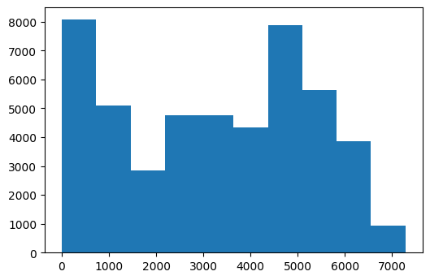
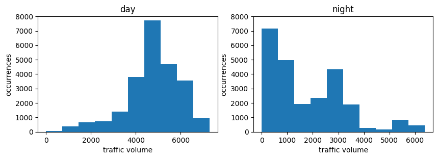
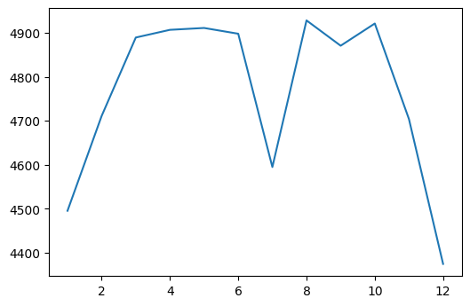
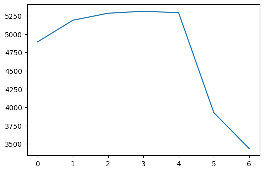
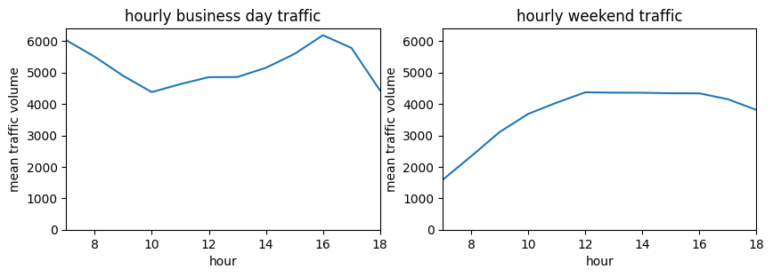
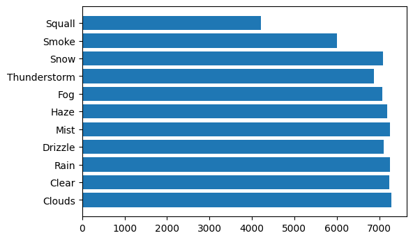
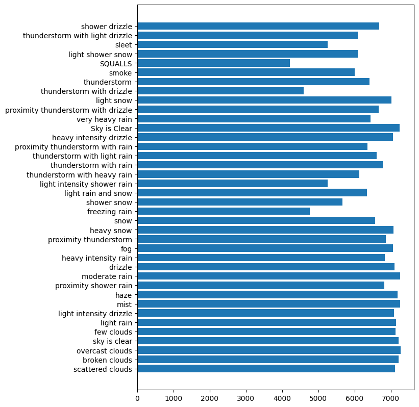

# I-94 Traffic Dataset

An exploration of traffic on a highway using python charts.

**Goals:**
* Visualize time series data with line plots.
* Visualize correlations with scatter plots.
* Visualize frequency distributions with bar plots and histograms.
* Speed up our exploratory data visualization workflow with the pandas library.
* Compare graphs using grid charts.

## Analyzing Traffic Volume


```python
import pandas as pd

traffic = pd.read_csv('Metro_Interstate_Traffic_Volume.csv')

print(traffic.head())
print(traffic.tail())
```

      holiday    temp  rain_1h  snow_1h  clouds_all weather_main  \
    0    None  288.28      0.0      0.0          40       Clouds   
    1    None  289.36      0.0      0.0          75       Clouds   
    2    None  289.58      0.0      0.0          90       Clouds   
    3    None  290.13      0.0      0.0          90       Clouds   
    4    None  291.14      0.0      0.0          75       Clouds   
    
      weather_description            date_time  traffic_volume  
    0    scattered clouds  2012-10-02 09:00:00            5545  
    1       broken clouds  2012-10-02 10:00:00            4516  
    2     overcast clouds  2012-10-02 11:00:00            4767  
    3     overcast clouds  2012-10-02 12:00:00            5026  
    4       broken clouds  2012-10-02 13:00:00            4918  
          holiday    temp  rain_1h  snow_1h  clouds_all  weather_main  \
    48199    None  283.45      0.0      0.0          75        Clouds   
    48200    None  282.76      0.0      0.0          90        Clouds   
    48201    None  282.73      0.0      0.0          90  Thunderstorm   
    48202    None  282.09      0.0      0.0          90        Clouds   
    48203    None  282.12      0.0      0.0          90        Clouds   
    
              weather_description            date_time  traffic_volume  
    48199           broken clouds  2018-09-30 19:00:00            3543  
    48200         overcast clouds  2018-09-30 20:00:00            2781  
    48201  proximity thunderstorm  2018-09-30 21:00:00            2159  
    48202         overcast clouds  2018-09-30 22:00:00            1450  
    48203         overcast clouds  2018-09-30 23:00:00             954  


```python
traffic.info()
```

    <class 'pandas.core.frame.DataFrame'>
    RangeIndex: 48204 entries, 0 to 48203
    Data columns (total 9 columns):
     #   Column               Non-Null Count  Dtype  
    ---  ------               --------------  -----  
     0   holiday              48204 non-null  object 
     1   temp                 48204 non-null  float64
     2   rain_1h              48204 non-null  float64
     3   snow_1h              48204 non-null  float64
     4   clouds_all           48204 non-null  int64  
     5   weather_main         48204 non-null  object 
     6   weather_description  48204 non-null  object 
     7   date_time            48204 non-null  object 
     8   traffic_volume       48204 non-null  int64  
    dtypes: float64(3), int64(2), object(4)
    memory usage: 3.3+ MB


```python
import matplotlib.pyplot as plt
%matplotlib inline
```


```python
plt.hist(traffic['traffic_volume'])
```


    (array([8089., 5102., 2839., 4753., 4770., 4342., 7888., 5636., 3857.,
             928.]),
     array([   0.,  728., 1456., 2184., 2912., 3640., 4368., 5096., 5824.,
            6552., 7280.]),
     <a list of 10 Patch objects>)


    

    


```python
traffic['traffic_volume'].describe()
```


    count    48204.000000
    mean      3259.818355
    std       1986.860670
    min          0.000000
    25%       1193.000000
    50%       3380.000000
    75%       4933.000000
    max       7280.000000
    Name: traffic_volume, dtype: float64


**Observations:**
* The traffic volume has been between 0-500 and 4500-5000 about 8000 times each, where it peaks.
* Traffic has only reached 6500-7000 under 1000 times, making this the least frequent level.
* The traffic appears to be about 3500 most of the time.
* Daytime and nighttime probably influence traffic volume because most people are on similar waking and working schedules, in general, although this isn't visualized in the above graph.

## Day vs. Night

The goal of this section is to compare traffic volume in the daytime hours (7am to 7pm) versus nighttime hours (7pm to 7am).

**Separating the daytime and nighttime data using the date_time column:**


```python
#pd.to_datetime(traffic['date_time'])
traffic['date_time'] = pd.to_datetime(traffic['date_time'])
print(traffic['date_time'])
```

    0       2012-10-02 09:00:00
    1       2012-10-02 10:00:00
    2       2012-10-02 11:00:00
    3       2012-10-02 12:00:00
    4       2012-10-02 13:00:00
                    ...        
    48199   2018-09-30 19:00:00
    48200   2018-09-30 20:00:00
    48201   2018-09-30 21:00:00
    48202   2018-09-30 22:00:00
    48203   2018-09-30 23:00:00
    Name: date_time, Length: 48204, dtype: datetime64[ns]


```python
time_of_day = traffic['date_time'].dt.hour
print(time_of_day)
```

    0         9
    1        10
    2        11
    3        12
    4        13
             ..
    48199    19
    48200    20
    48201    21
    48202    22
    48203    23
    Name: date_time, Length: 48204, dtype: int64


```python
daytime_bool = ((time_of_day >= 7)&(time_of_day < 19))
print(daytime_bool)
```

    0         True
    1         True
    2         True
    3         True
    4         True
             ...  
    48199    False
    48200    False
    48201    False
    48202    False
    48203    False
    Name: date_time, Length: 48204, dtype: bool


```python
daytime_slice = traffic[daytime_bool]
print(daytime_slice)
```

          holiday    temp  rain_1h  snow_1h  clouds_all weather_main  \
    0        None  288.28     0.00      0.0          40       Clouds   
    1        None  289.36     0.00      0.0          75       Clouds   
    2        None  289.58     0.00      0.0          90       Clouds   
    3        None  290.13     0.00      0.0          90       Clouds   
    4        None  291.14     0.00      0.0          75       Clouds   
    ...       ...     ...      ...      ...         ...          ...   
    48194    None  283.84     0.00      0.0          75         Rain   
    48195    None  283.84     0.00      0.0          75      Drizzle   
    48196    None  284.38     0.00      0.0          75         Rain   
    48197    None  284.79     0.00      0.0          75       Clouds   
    48198    None  284.20     0.25      0.0          75         Rain   
    
               weather_description           date_time  traffic_volume  
    0             scattered clouds 2012-10-02 09:00:00            5545  
    1                broken clouds 2012-10-02 10:00:00            4516  
    2              overcast clouds 2012-10-02 11:00:00            4767  
    3              overcast clouds 2012-10-02 12:00:00            5026  
    4                broken clouds 2012-10-02 13:00:00            4918  
    ...                        ...                 ...             ...  
    48194    proximity shower rain 2018-09-30 15:00:00            4302  
    48195  light intensity drizzle 2018-09-30 15:00:00            4302  
    48196               light rain 2018-09-30 16:00:00            4283  
    48197            broken clouds 2018-09-30 17:00:00            4132  
    48198               light rain 2018-09-30 18:00:00            3947  
    
    [23877 rows x 9 columns]


```python
nighttime_bool = (daytime_bool==False)
print(nighttime_bool)
```

    0        False
    1        False
    2        False
    3        False
    4        False
             ...  
    48199     True
    48200     True
    48201     True
    48202     True
    48203     True
    Name: date_time, Length: 48204, dtype: bool


```python
nighttime_slice = traffic[nighttime_bool]
print(nighttime_slice)
```

          holiday    temp  rain_1h  snow_1h  clouds_all  weather_main  \
    10       None  290.97      0.0      0.0          20        Clouds   
    11       None  289.38      0.0      0.0           1         Clear   
    12       None  288.61      0.0      0.0           1         Clear   
    13       None  287.16      0.0      0.0           1         Clear   
    14       None  285.45      0.0      0.0           1         Clear   
    ...       ...     ...      ...      ...         ...           ...   
    48199    None  283.45      0.0      0.0          75        Clouds   
    48200    None  282.76      0.0      0.0          90        Clouds   
    48201    None  282.73      0.0      0.0          90  Thunderstorm   
    48202    None  282.09      0.0      0.0          90        Clouds   
    48203    None  282.12      0.0      0.0          90        Clouds   
    
              weather_description           date_time  traffic_volume  
    10                 few clouds 2012-10-02 19:00:00            3539  
    11               sky is clear 2012-10-02 20:00:00            2784  
    12               sky is clear 2012-10-02 21:00:00            2361  
    13               sky is clear 2012-10-02 22:00:00            1529  
    14               sky is clear 2012-10-02 23:00:00             963  
    ...                       ...                 ...             ...  
    48199           broken clouds 2018-09-30 19:00:00            3543  
    48200         overcast clouds 2018-09-30 20:00:00            2781  
    48201  proximity thunderstorm 2018-09-30 21:00:00            2159  
    48202         overcast clouds 2018-09-30 22:00:00            1450  
    48203         overcast clouds 2018-09-30 23:00:00             954  
    
    [24327 rows x 9 columns]


```python
plt.figure(figsize=(10,3)) #figsize is in inches
plt.subplot(1, 2, 1) #rows, columns, position
plt.hist(daytime_slice['traffic_volume'])
plt.title('day')
plt.xlabel('traffic volume')
plt.ylabel('occurrences')
plt.ylim([0,8000])

#for in in range 10:
    #plt.xticks(ticks=[0,750,1500,2250, 3000], rotation = 30)

plt.subplot(1, 2, 2) #rows, columns, position
plt.hist(nighttime_slice['traffic_volume'])
plt.title('night')
plt.xlabel('traffic volume')
plt.ylabel('occurrences')
plt.ylim([0,8000])

plt.show()
```


    

    


```python
nighttime_slice['traffic_volume'].describe()
```


    count    24327.000000
    mean      1785.377441
    std       1441.951197
    min          0.000000
    25%        530.000000
    50%       1287.000000
    75%       2819.000000
    max       6386.000000
    Name: traffic_volume, dtype: float64


```python
daytime_slice['traffic_volume'].describe()
```


    count    23877.000000
    mean      4762.047452
    std       1174.546482
    min          0.000000
    25%       4252.000000
    50%       4820.000000
    75%       5559.000000
    max       7280.000000
    Name: traffic_volume, dtype: float64


**Observations:**
* The daytime data is left-skewed, with more frequent occurrences of high traffic. The dataset has a higher mean and max traffic volume.
* The nighttime data is right-skewed, with more frequent occurrences of lower traffic volumes. There is a small peak of mid-level traffic volumes. The dataset has a lower mean and max traffic volume.

## Time Indicators

Since traffic at night is light, and we are interested in observing heavy traffic, this section looks at the daytime data only. Traffic over time during the day will be analyzed here.

### Monthly Traffic


```python
daytime_slice['date_time'].dt.month
```


    0        10
    1        10
    2        10
    3        10
    4        10
             ..
    48194     9
    48195     9
    48196     9
    48197     9
    48198     9
    Name: date_time, Length: 23877, dtype: int64


```python
day = pd.DataFrame(daytime_slice) #convert slice/view to new data table 
day['month'] = day['date_time'].dt.month #add a month column
print(day)
```

          holiday    temp  rain_1h  snow_1h  clouds_all weather_main  \
    0        None  288.28     0.00      0.0          40       Clouds   
    1        None  289.36     0.00      0.0          75       Clouds   
    2        None  289.58     0.00      0.0          90       Clouds   
    3        None  290.13     0.00      0.0          90       Clouds   
    4        None  291.14     0.00      0.0          75       Clouds   
    ...       ...     ...      ...      ...         ...          ...   
    48194    None  283.84     0.00      0.0          75         Rain   
    48195    None  283.84     0.00      0.0          75      Drizzle   
    48196    None  284.38     0.00      0.0          75         Rain   
    48197    None  284.79     0.00      0.0          75       Clouds   
    48198    None  284.20     0.25      0.0          75         Rain   
    
               weather_description           date_time  traffic_volume  month  
    0             scattered clouds 2012-10-02 09:00:00            5545     10  
    1                broken clouds 2012-10-02 10:00:00            4516     10  
    2              overcast clouds 2012-10-02 11:00:00            4767     10  
    3              overcast clouds 2012-10-02 12:00:00            5026     10  
    4                broken clouds 2012-10-02 13:00:00            4918     10  
    ...                        ...                 ...             ...    ...  
    48194    proximity shower rain 2018-09-30 15:00:00            4302      9  
    48195  light intensity drizzle 2018-09-30 15:00:00            4302      9  
    48196               light rain 2018-09-30 16:00:00            4283      9  
    48197            broken clouds 2018-09-30 17:00:00            4132      9  
    48198               light rain 2018-09-30 18:00:00            3947      9  
    
    [23877 rows x 10 columns]


```python
by_month = day.groupby('month').mean() #group the dataset by the month column with the mean as an aggregate function
print(by_month)
```

                 temp   rain_1h   snow_1h  clouds_all  traffic_volume
    month                                                            
    1      265.483409  0.015080  0.000631   58.554108     4495.613727
    2      266.663789  0.004019  0.000000   51.550459     4711.198394
    3      273.619940  0.015839  0.000000   56.827811     4889.409560
    4      279.661071  0.105343  0.000000   59.221525     4906.894305
    5      289.282668  0.130863  0.000000   56.548825     4911.121609
    6      294.576068  0.271121  0.000000   48.612374     4898.019566
    7      296.785052  4.412258  0.000000   42.176619     4595.035744
    8      295.119191  0.228113  0.000000   42.556892     4928.302035
    9      292.520287  0.289807  0.000000   45.184112     4870.783145
    10     284.081011  0.016065  0.000000   53.497990     4921.234922
    11     276.698007  0.006200  0.000000   56.697187     4704.094319
    12     267.727846  0.035365  0.002213   66.942237     4374.834566


```python
by_month['traffic_volume']
```


    month
    1     4495.613727
    2     4711.198394
    3     4889.409560
    4     4906.894305
    5     4911.121609
    6     4898.019566
    7     4595.035744
    8     4928.302035
    9     4870.783145
    10    4921.234922
    11    4704.094319
    12    4374.834566
    Name: traffic_volume, dtype: float64


```python
plt.plot(by_month['traffic_volume'])
plt.show()
```


    

    


**Observations:**
* Traffic is a bit lower in Winter and July.

### Daily Traffic


```python
day['dayofweek'] = day['date_time'].dt.dayofweek
by_dayofweek = day.groupby('dayofweek').mean()
by_dayofweek['traffic_volume']  # 0 is Monday, 6 is Sunday
```


    dayofweek
    0    4893.551286
    1    5189.004782
    2    5284.454282
    3    5311.303730
    4    5291.600829
    5    3927.249558
    6    3436.541789
    Name: traffic_volume, dtype: float64


```python
plt.plot(by_dayofweek['traffic_volume'])
plt.show()
```


    

    


**Observations:**
* Traffic volume rises slightly from Monday to Friday and drops off sharply over the weekend.

### Hourly Traffic


```python
day['hour'] = day['date_time'].dt.hour
bussiness_days = day.copy()[day['dayofweek'] <= 4] # 4 == Friday
weekend = day.copy()[day['dayofweek'] >= 5] # 5 == Saturday
by_hour_business = bussiness_days.groupby('hour').mean()
by_hour_weekend = weekend.groupby('hour').mean()

print(by_hour_business['traffic_volume'])
print(by_hour_weekend['traffic_volume'])
```

    hour
    7     6030.413559
    8     5503.497970
    9     4895.269257
    10    4378.419118
    11    4633.419470
    12    4855.382143
    13    4859.180473
    14    5152.995778
    15    5592.897768
    16    6189.473647
    17    5784.827133
    18    4434.209431
    Name: traffic_volume, dtype: float64
    hour
    7     1589.365894
    8     2338.578073
    9     3111.623917
    10    3686.632302
    11    4044.154955
    12    4372.482883
    13    4362.296564
    14    4358.543796
    15    4342.456881
    16    4339.693805
    17    4151.919929
    18    3811.792279
    Name: traffic_volume, dtype: float64


```python
plt.figure(figsize=(10,3)) #figsize is in inches
plt.subplot(1, 2, 1) #rows, columns, position
plt.title('hourly business day traffic')
plt.ylim([0, 6400])
plt.xlim([7, 18])
plt.xlabel('hour')
plt.ylabel('mean traffic volume')
plt.plot(by_hour_business['traffic_volume'])

plt.subplot(1, 2, 2)
plt.title('hourly weekend traffic')
plt.ylim([0, 6400])
plt.xlim([7, 18])
plt.xlabel('hour')
plt.ylabel('mean traffic volume')
plt.plot(by_hour_weekend['traffic_volume'])

plt.show()
```


    

    


**Observations:**
* There are rush hours at 7am and 4pm (16:00) during business days. 
* In contrast, traffic is lowest at 7am on weekends and about the same at other times. Not as many people would choose to be traveling at 7am if not for business apparently.

### Summary of Time Indicators for Traffic Volume

Durring the day, traffic is about the same on average most months of the year except for winter and July, where it dips. Traffic is higher on average during the week than during the weekends. Traffic is higher in the early morning and early evening hours during business days. Traffic is lower in the early morning hours during weekends.

## Weather Indicators

A look at how weather affects traffic volume.

### Numerical Indicators


```python
weather_corr = day.corr()[['traffic_volume','temp', 'rain_1h', 'snow_1h', 'clouds_all']]# non-nummerical columns: 'clouds_all', 'weather_main', 'weather_description'
print(weather_corr)
```

                    traffic_volume      temp   rain_1h   snow_1h  clouds_all
    temp                  0.128317  1.000000  0.010815 -0.019286   -0.135519
    rain_1h               0.003697  0.010815  1.000000 -0.000091    0.004993
    snow_1h               0.001265 -0.019286 -0.000091  1.000000    0.027721
    clouds_all           -0.032932 -0.135519  0.004993  0.027721    1.000000
    traffic_volume        1.000000  0.128317  0.003697  0.001265   -0.032932
    month                -0.022337  0.222072  0.001176  0.026768    0.000595
    dayofweek            -0.416453  0.000188 -0.009683 -0.008814   -0.041980
    hour                  0.172704  0.162691  0.008279  0.003923    0.023685


The weather variables are all weakly correlated with traffic. Temp has the strongest of the set, but none seem to be reliable indicators of heavy traffic.

### Non-numerical Indicators


```python
plt.barh(day['weather_main'], day['traffic_volume'])
#plt.yticks(ticks=[0, 1, 2...],
#          labels=['Squall', ....])
plt.show()
```


    

    


```python
plt.figure(figsize = (7, 10)) # made larger so words don't overlap
plt.barh(day['weather_description'], day['traffic_volume'])
plt.show()
```


    

    


**Observations:***
* The heaviest weather indicator affecting traffic volume appears to be squalls (wind). This is associated with decreased traffic.
* Smoke, freezing rain, certain thunderstorms, sleet, and light intensity shower rain are also associated with decreased traffic to a lesser extent.
* Traffic appears to be about the same, around 7000 cars, for other weather types, including other kinds of rain and thunderstorms, fog, and all kinds of snow.

## Conclusion

Traffic volume on the I-94 appears to be affected by month of year, day of the week, time of day, and weather factors. Traffic maxes at around 7-8 thousand during the most favorable times for traffic and can dip to almost zero during the least favorable times. Traffic is higher during warmer months (Except July), business days, commuting times, days, and most weather conditions. Traffic is lower during colder months, weekends, nights, and certain weather conditions described above.
